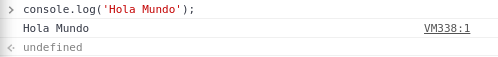
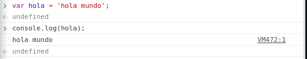
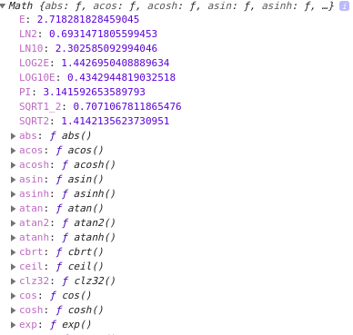
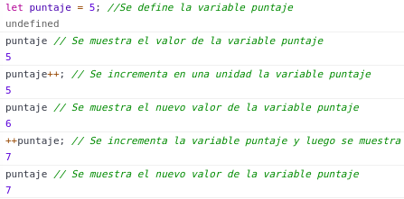
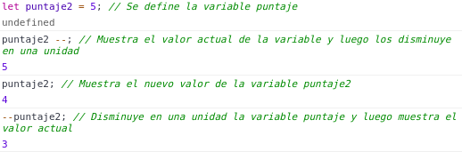
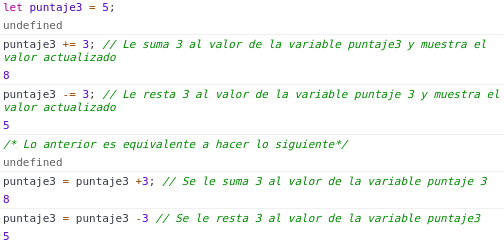

# Anotaciones Curso de JavaScript

## Definiciones Generales

- **ECMAScript:** Es la especificación para crear un lenguaje de scripting.
Los navegadores utilizan ECMAScript para interpretar el código JavaScript.
Dicta la reglas, detalles y lineamientos que un lenguaje de scripting debe seguir para ser considerado por ECMAScript.

- **JavaScript:** Es un lenguaje de Scripting que sigue la especificación de ECMAScript.
Es un dialecto del lenguaje de ECMAScript.

- **Frameworks JavaScript:** Angular, React y VueJS (entre otros) son frameworks front-end para aplicaciones utilizados para simplificar la construcción de aplicaciones avanzadas e interactivas. Estas librerías tienen la ventaja de que tienen varias funciones ya hechas que se encuentran disponibles para facilitar el desarrollo de aplicaciones.

- **NodeJS:** Plataforma hecha en JavaScript que se utiliza para realizar operaciones avanzadas y aplicaciones en servidores y computadoras con JavaScript. NodeJS permite la utilización de **NPM** que son una gran cantidad de librerías que se pueden utilizar con esta plataforma.

## Herramientas necesarias

Se recomienda instalar Visual Studio Code ya que tiene herramientas que funcionan perfectamente con JavaScript. En Visual Studio Code se recomienda instalar los siguientes paquetes:

- **Live Server:** Es de Ritwick Dey. Permite crear un servidor local. Gracias a Live Server se abrirá el navegador con el server local de nuestro archivo, en el navegador hay que tener la consola abierta.
- **Bracket Pair Colorizer:** Es de CoenraadS. Permite que los distintos paréntesis tenga colores diferentes según nivel al que se encuentren.
- **editor.wordWarp:** Al estar encendido permite que cuando se escriba mucho código, el código siempre se mantenga en pantalla (no se vaya para al lado).
- Se recomienda utilizar **emmet**. 

## Fundamentos de JavaScript 

### Primeros pasos con JavaScript

- Primero se debe crear un archivo con extensión *.js* con cualquier nombre (que no tenga caracteres raros) por ejemplo *app.js*.

- Luego se debe crear un archivo *index.html*. Dentro del archivo tecleando un signo de exclamación *!* y luego *TAB*, se crea la plantilla del HTML gracias a emmet.

- Para crear el primer programa en JS (Hola Mundo), dentro del index.html se debe agregar un `<div id="app"></div>` (donde el id será app, aunque puede ser el que uno deseé) la cual se irá llenando con JavaScript posteriormente.

- Luego hay que crear un etiqueta `<script></script>` la cual el navegador interpretará como que es JS y no otra cosa como HTML o CSS (cabe mencionar que para este último existe la etiqueta `<style></style>`).

- JavaScript permite hacer cosas como que el *div* vacío que creamos anteriormente haga algo. Por ejemplo un *Hola Mundo* sería de la siguiente manera: 

```html
<script>
    document.getElementById('app').innerHTML = 'Hola Mundo';
</script>
```
Lo anterior es en el caso de que no exista un archivo con extensión *.js* (en este caso existe el archivo y el ide del *div* vacío lleva en su id el nombre de ese archivo)

- Existiendo un archivo *.js* al cual hacer referencia, el bloque de código *html* queda de la siguiente manera:

```html
<script src=app.js></script> <!--Es similar a como se ponen imágenes en HTML, se pone sólo app.js porque ambos archivos se encuentran en el mismo directorio y al mismo nivel de lo contrario se coloca el directorio primero. Ejemplo JavaScript/app.js-->
```
- Se recomienda que la etiqueta *script* se encuentre antes del final de la etiqueta *body*. Esto se debe a que HTML carga desde arriba hacía abajo el código por lo cual poner código pesado de JS haría que se demorará más en cargar el página.

### Primer programa en JavaScript

El siguiente bloque de código pide mediante un prompt (una especie de cuadro de dialogo) un nombre y edad para luego mostrarlos en la página (el index.html básicamente). Lo anterior es posible debido a las etiquetas *div* y *script* que previamente pusimos en el *index.html*.

```js 
let nombre = prompt('¿Cual es tu nombre?'); /*Mediante un cuadro de dialogo pide el nombre. Cabe mencionar que el nombre no está siendo definido como un string o algo por el estilo, por lo cual se puede llenar con cualquier tipo de carácter*/

let edad = prompt('¿Cual es tu edad?'); /*Mediante un cuadro de dialogo pide la edad. Cabe mencionar que la edad no está siendo definida como un entero o algo por el estilo, por lo cual se puede llenar con cualquier tipo de carácter*/
/*Ambos cuadros de dialogo aparecen antes de que se termine de cargar la página*/

document.getElementById('app').innerHTML = `Bienvenido ${nombre} de ${edad} años`; /*Muestra el mensaje de Bienvenido {nombre} de {edad} años en el index.html debido a la sección asignada con las etiquetas scripts. Si no se llenan los cuadros de dialogo, el mensaje mostrará null en ambos "valores".*/
```
### La consola de Chrome

Cada navegador tiene su propia consola pero la de Chrome suele ser la mejor para trabajar con JS.

La consola es excelente al momento de probar el código de JS y ver errores en él.

La consola del navegador devuelve de un color los número y de otro color las cadenas de caracteres.

Existe algo que se llama la **Ventana Global** `document` que devuelve todo lo que tiene que ver con el HTML.

#### Enviar valores a la consola

Para enviar valores a la consola desde un archivo *JS* se debe ocupar el siguiente comando `console.log();`. Utilizar `console.log();` es muy útil debido a que permite comprobar las cosas que uno hace en *JS*.

```js
console.log("Enviando a la consola");
console.log('hasta aquí todo bien');
console.log(2+2); 
console.log(true); 
console.log('ID:'+ 20); /*Con console.log() se puede enviar todo tipo de valores a la consola.*/
```

Desde la consola del navegador se puede utilizar `console.log()`. Cabe mencionar que puede llegar a salir *undefined* debido a que la función no retorna un valor.



Dentro de la misma consola se pueden definir variables, las cuales se pueden enviar para que sean mostradas (muy parecido a como cuando se trabajaba en el IDE de python). Cabe mencionar que cuando se manda una variable por consola, se pone sólo el nombre de la variable y no entre comillas como cuando se manda una cadena de caracteres y cosas por el estilo.



Como se dijo anteriormente se puede enviar de todo por `console.log()` como por ejemplo arreglos.

La función anterior no es la única que existe para mostrar valores en la consola, también existe `console.table()` que muestra los valores en forma de una tabla. Ejemplo de lo anterior sería `console.table([1,2,3]);`

.png)

Los anteriores son ejemplos de las funciones tipo console que tiene JS.

#### Tiempo de Ejecución

Para ver el tiempo de ejecución de nuestro código en JS existe las funciones `console.time();` y `console.timeEND();` las cuales marcan el inicio y el fin (respectivamente) del código que queremos ejecutar. Ambos reciben variables que pueden ser desde cadenas de caracteres puestas directamente o variables previamente definidas.

-y-console.timeEND().png)

### Consideraciones con el punto y coma

En JavaScript el *;* no es obligatorio pero por buena práctica se debe utilizar como si este fuera obligatorio. El punto y coma sirve para indicar cuando finaliza una línea de código.

### ESLint para solucionar errores de código

Revisa el código que se escribe para corregir el estilo en el cual se escribe el código de JS. Se debe configurar manualmente. ESLint puede corregir errores en base a lo que se configuró previamente.

### Variables en JavaScripts

Existen formas de darle nombre a una variable creada que aparte de ser una buena práctica, también ayudan a entender mejor el código. Estas formas son: 

- Camelcase: Es donde el segundo nombre de la variable lleva mayúscula. 

```js
var nombreVariable = 'Algo'; //Ejemplo de camelcase
```

- Underscore: Es donde los nombres de la variable se separan por un guión bajo.

```js
var nombre_variable = 'Algo'; //Ejemplo de underscore
```

- Pascalcase: Es donde todos los nombres de la variable llevan mayúscula.

```js
var NombreVariable = 'Algo'; //Ejemplo de pascalcase
```

Los siguientes tipos de variables son soportados por todos los navegadores.

#### Var

**Ya no se recomienda la variable de tipo VAR**

Para crear una variable de tipo *VAR* se debe hacer lo siguiente: 

```js
var nombre = 'Juan'; //Puede ser con comillas simples o dobles.

nombre = 'John'; //Sin necesidad de anteponer VAR se puede cambiar el contenido de la variable de tipo VAR, debido a que esta ya fue definida con anterioridad.

var nombre = 'Pedro'; //En este caso se vuelve a declarar la variable nombre y ya que es VAR no hay problema en hacerlo.

```

Primero se pone el tipo de la variable (*VAR* en este caso), luego un nombre para la variable **(los nombres de variables deben ser con letras primero y después números. Tampoco deben tener caracteres especiales al inicio)** y después lo que contendrá la variable.

De igual forma **se pueden inicializar variables sin valor**.

```js
var nombre; //La variable nombre de tipo VAR no tiene valor previamente definido
```
Además se pueden inicializar más de un mismo tipo de variable en una misma línea, sólo se tienen que separar por una coma.

```js
var variable = 0, variable2 = 1, variable3 = 2; //Se definieron tres variables en una sola línea.
```

#### Let

**Se recomienda el uso de *let* cuando el valor será sobrescrito y no se volverá a definir**

A diferencia de *VAR*, no se pueden volver a declarar. Sólo se puede volver a dar valor.

```js
let variable1 = 'Libro'; //Se crea la variable1 de tipo let que contiene a Libro

variable1 = 'Libro 1'; //Se cambia el valor de la variable1 a Libro 1

let variable1 = 'Libro 2' //Tira error debido a que al ser de tipo let no se puede volver a declarar
```

#### Const

**Se recomienda su uso cuando se sabe que el valor asignado se mantendrá constante siempre**.

Las variables de tipo *const* deben inicializarse siempre, no pueden ir vacías desde su creación. Tampoco se le pueden reasignar un valor a este tipo de variable. 

```js
const producto = 'Libro'; //Se define una variable producto de tipo const

console.log(producto); // Se muestra por consola del navegador la variable producto

producto = 'Libro2' // La consola tira muestra el siguiente error: Uncaught TypeError: Assignment to constant variable.
```

### Strings o Cadenas de Texto y sus métodos

#### Creación de un string

Los *strings* representan un texto que se le puede asignar a una variable.

Existen dos formas de crear una cadena de texto:

1. Creación del *string* mediante el uso de comillas dobles en el valor de la variable.

```js
//Creación de la variable producto
//Prima forma de crear un string
const producto = "Monitor de 20 pulgadas"; //La variable ya es un string al momento de ponerle las comillas en su definición
```
En este caso se **debe usar comillas dobles** al momento de darle valor a la variable.

2. Creación del *string* mediante el uso del objeto (quizás función, investigar más eso) `String()`.

```js
//Creación de la variable producto2
//Segunda forma de crear un string
const producto2 = String('Monitor 24 Pulgadas'); //El valor de la variable es dado en base al objeto String() que recibe la cadena de caracteres que nosotros enviemos entre comillas simples.
```
3. Creación de un nuevo objeto *string*.

```js
//Creación de la variable producto3
//Tercera forma de crear un string (es poco común)
const producto3 = new String('Monitor de 27 pulgadas'); // Aquí el String está siendo creado como si fuera un objeto nuevo
```
**Nota: En el caso de que se quiera poner comillas dobles o simples dentro de un string que comience y finalice con comillas dobles simples respectivamente, se debe ¿escapar? las comillas que no hagan referencia al final del string. Lo anterior se hace utilizando un backslash** 
```js
const producto = "Monitor de 20\" "
```

#### Métodos de un String

Debido a que los *strings* son una clase, estos cuentan con métodos que sirven para realizar distintas tareas de forma fácil y sencilla.

##### indexOf

Entrega en que posición del *string* se encuentran una palabra buscada. Entrega la posición dentro de la cadena de caracteres (el inicio de la palabra buscada) y si no se encuentra entrega un *-1*.

```js
/*variable.indexOf('palabra')*/

//Creación de la variable producto
const producto = "Tablet 7\" 8 Gb y 1 Gb Ram";

//Muestra por consola la variable producto
console.log(producto);

//Muestra la posición dentro del producto (que es un string) donde inicia la palabra Tablet
console.log(producto.indexOf('Tablet'));

//Cabe mencionar que el método diferencia entre minúsculas y mayúsculas
console.log(producto.indexOf('tablet')); //Muestra un -1 por consola

console.log(producto.indexOf('Monitor')); //Muestra -1 en la consola debido a que Monitor no se encuentra en la variable producto
```

##### Includes

Sirve para saber si dentro de una string se encuentra una palabra especifica. Este método **recibe** la palabra a buscar entre comillas simples y distingue entre minúsculas y mayúsculas, y **entrega** un valor booleano (true o false).

```js
/*variable.includes('palabra')*/

//Creación de la variable producto
const producto = 'Monitor de 32 pulgadas';

//Muestra por consola la variable producto
console.log(producto);

//Muestra true o false dependiendo de si la palabra Monitor se encuentra en el string producto
console.log(producto.includes('Monitor')); //Entrega True por consola

//Cabe mencionar que el método includes distingue entre minúsculas y mayúsculas
console.log(producto.includes('monitor')); //Entrega False por consola

console.log(producto.includes('Tablet')); //Entrega False por consola debido a que no se encuentra la palabra Tablet dentro del string producto
```

##### Length

Sirve para conocer la cantidad de caracteres que componen a un string. 

```js
/*variable.length()*/

//Creación de la variable producto2
const producto2 = 'Monitor 20 pulgadas';

//Creación de la variable cantidadCaracteres la cual contiene la cantidad de caracteres del string producto2
const cantidadCaracteres = producto2.length;

//Muestra por consola el valor de la variable producto2
console.log(producto2);

//Muestra por consola la cantidad de caracteres que componen a la variable producto
console.log(cantidadCaracteres);

/*No es necesario crear una nueva variable para la cantidad de caracteres del string*/
```

##### Concatenar un String (Unir Strings)

Sirve para unir strings. Existe tres formas para concatenar strings (la mejor es la tercera).

- **Forma 1:** Utilizando el método concat. El método concat une dos strings.

```js
//Se define la variable producto
const producto = 'Monitor 20 Pulgadas';

//Se define la variable precio
const precio = '30 USD';

//Se concatena la precio a la variable producto y se muestra por consola el resultado
console.log(producto.concat(precio)); //En la consola se muestra Monitor 20 Pulgadas30 USD

//Se concatena al producto la cadena de caracteres En Descuento
console.log(producto.concat(' En Descuento'));
```

- **Forma 2:** Utilizando el signo +. Es una sintaxis muy sencilla pero puede llegar a traer problemas cuando el output es muy grande.

```js
console.log( producto + precio ); //El signo + sirve para concatenar uno o más strings

console.log( producto + "Con un precio de: " + precio ); //Además se le pueden concatenar cadenas de caracteres que no necesariamente son variables previamente definidas 
```
- **Forma3:** Template Strings o Template Literal.

##### Template Strings (concatenación ECMAScript)

Con la llegada de ECMAScript 6, se introdujo un cambió a la concatenación de strings la cual se basa en la utilización del Backtick *`* en vez de comillas dobles o triples, además se elimina el uso del signo *+* y ahora para agregar una variable a lo que se quiere mostrar se utiliza la siguiente sintaxis ${variable}.

```js
console.log(`El producto ${producto} tiene un precio de ${precio}`); //Esta sintaxis es cómoda cuando se tiene un output muy grande.
```

##### Cortar espacios en blanco de un String

Para eliminar los espacios en blanco que vengan en una variable, se pueden utilizar los métodos trim(), trimStart() y trimEnd(), los cuales permiten eliminar los espacios en blanco tanto al inicio como al final, sólo los del inicio y sólo los del final respectivamente. Cabe mencionar que el método trim() es el más antiguo de los tres, ya que tanto trimStart() como trimEnd() son mucho más nuevos.

```js
// Definición de la variable producto con un valor tipo string que tiene muchos espacios
const producto = '     Monitor 20 Pulgadas     ';

// Se muestra por consola la variable producto
console.log(producto);

// Se muestra por consola el largo de la variable producto
console.log(producto.length); // El método length considera los espacios en blanco que contiene la variable

// Eliminación los espacios en blanco tanto al inicio como al final
console.log(producto.trim()); 

// Eliminación de espacios en blanco del inicio
console.log(producto.trimStart()); //trimStart se encarga de eliminar los espacios en blanco que se encuentran al inicio (no los del final) de la variable producto

// Eliminación de espacios en blanco del final
console.log(producto.trimEnd()); //trimEnd elimina los espacios en blanco que se encuentran al final de la variable producto (no los del inicio)

/* En JavaScript se pueden utilizar los métodos de forma encadenada, lo cual se llama Chaining o sea que se puede utilizar un método seguido de otro método */

console.log(producto.trimStart().trimEnd()); //La encadenación de trimStart().trimEnd() elimina los espacios en blanco tanto del inicio como del final de la variable producto
```
##### Replace

Sirve para reemplazar un palabra dentro de un *string* por otra como también se puede reemplazar el valor de un string por el de otro.

```js
// Definición de la variable producto
const producto = 'Monitor 20 Pulgadas';

// Se muestra por consola la variable producto
console.log(producto);

// Se reemplaza Pulgadas por comillas dobles "
console.log(producto.replace('Pulgadas', '"'));

// Se reemplaza Monitor por Monitor Curvo
console.log(producto.replace('Monitor','Monitor Curvo'));

/* Lo anterior sumamente util cuando se requiere reemplazar palabras de muchas variables */
```

##### Slice

Sirve para cortar un trozo del string indicando la posición del inicio del corte y el posición dle final del corte.

```js
console.log(producto.slice(0 , 10)); //Corta la variable producto desde la posición 0 hasta la posición 10 mostrando por consola Monitor 20

console.log(producto.slice(8)); //Corta la variable producto desde la posición 8 hasta el final del string. Lo anterior se debe a que no se le paso una posición de termino

console.log|(producto.slice(2 , 1)); //No muestra nada. Si el primer número es mayor que el segundo, JS no hará nada
```

##### Substring

Al igual que *variable.slice()* sirve para cortar un trozo del string pero con la gran diferencia que el utilizar *variable.substring()* permite que cuando el indice de inicio sea mayor que el indice de termino (*slice* en este caso no hace nada), *substring* interpreta que el indice menor es el de inicio y el indice mayor es el de termino.

```js
console.log(producto.substring(0 , 10)); //Corta la variable producto desde la posición 0 hasta la posición 10 mostrando por consola Monitor 20

console.log(producto.substring(10 , 0)); // Hace lo mismo que la línea de código anterior a pesar de que están mal ingresados los valores
```

##### Repeat

Sirve para repetir n cantidad de veces un *string*. Da igual que valor se le entregue al método, siempre se aproximará al entero más cercano.

```js
// Se define la variable texto la cual es la repetición triple de la cadena ' en Promoción'
const texto = ' en Promoción'.repeat(3);

//Se muestra en la consola el contenido de la variable texto
console.log(texto);
```

##### Split

Sirve para dividir una cadena de texto en base a un carácter o palabra que uno le entregue al método.

```js
// Se crea la variable hobbies que contiene una cadena compuesta por diferentes actividades
const hobbies = 'Leer, caminar, escuchar música, escribir, aprender a programar';

// Se divide la cadena contenida en la variable hobbies por el carácter "," y muestra en modo de tabla en la consola una tabla con las actividades ya separadas una de otras
console.table(hobbies.split(","));
```

##### Convertir en Mayúsculas

El método *toUpperCase()* sirve para transformar en mayúscula todos los caracteres de una cadena de texto contenida en una variable.

##### Convertir en minúsculas

El método *toLowerCase()* sirve para transformar en minúscula todos los caracteres de una cadena de texto contenida en una variable.

Lo anterior es muy util cuando existen datos que da igual si están en mayúsculas o minúsculas por lo cual se transforman todos a minúsculas y se trabajan de esa manera. Un ejemplo de lo anterior son los e-mails.

##### Convertir un número en string

El método *toString()* sirve para transformar un número en un string. Cabe mencionar que un número en string y un número normal tienen diferentes colores al ser mostrados en la consola del navegador y en JS no son lo mismo.

```js
// Se crea la variable precio que contiene un número
const precio = 300;

// Se muestra la variable precio por consola
console.log(precio);

// Se crea la variable precioString la cual contendrá una versión en string del precio (este paso no es necesario)
const precioString = precio.toString();

// Se muestra por consola la variable precioString (el uso de .toString() puede ser dentro de console.log())
console.log(precioString);
```
### Números en JavaScript

#### Creación de números en JavaScript

A diferencia de los otros lenguajes, en JavaScript todo los números se crean de la misma forma (ya sea un entero, un flotante o un double). Sumado a lo anterior hay que aclarar que un número de tipo *string* es distinto a un número como tal.

```js
/* Tipos de números que se pueden crear en JS*/

// Se crea la variable numero1 que es un número entero
const numero1 = 30;

// Se crea la variable numero2 que es un número entero
const numero2 = 20;

// Se crea la variable numero3 que es un flotante
const numero3 = 20.20;

// Se crea la variable numero4 que es un flotante
const numero4 = .102030;

// Se crea la variable numero5 que es un flotante
const numero5 = -20;
```

#### Operaciones en JavaScript

Existiendo números, existen operaciones matemáticas que se pueden realizar con ellos.

##### Suma 

Para la suma, se utiliza el operador *+*. Ya que las variables son números, no hay conflicto con respecto a la concatenación de *strings*.

```js
// Se crea la variable numero1 que es un número entero
const numero1 = 30;

// Se crea la variable numero2 que es un número entero
const numero2 = 20;

// Se crea la variable resultadoSuma que guardará el resultado de la Suma (este paso no es necesario)
let resultadoSuma;

// Suma 
resultadoSuma = numero1 + numero2;
```

##### Resta 

Para la resta se utiliza el operador *-*.

```js
// Se crea la variable resultadoResta que guardará el resultado de la Resta
let resultadoResta;

// Resta 
resultadoResta = numero1 - numero2;
```

##### Multiplicación

Para la multiplicación se utiliza el operador *\**.

```js
// Se crea la variable resultadoMulti que guardará el resultado de la Multiplicación
let resultadoMulti;

// Multiplicación
resultadoMulti = numero1 * numero2;
```

##### División 

Para la división se utiliza el operador */*.

```js
// Se crea la variable resultadoDivision que guardará el resultado de la División
let resultadoDivision;

// División
resultadoDivision = numero1 / numero2;
```
##### Modulo

El modulo de una división es el residuo que queda de la división entera ente el dividendo y el divisor. En el caso del modulo, el operador a utilizar es el *%*.

```js
// Se crea la variable resultadoModulo que guardará el resultado del Modulo
let resultadoModulo;

// Modulo
resultadoModulo = numero1 % numero2; 
```

#### El Objeto Math

En la consola del navegador se puede ingresar el código `Math` y presionar *enter* (existe en la ventana global de JS), de esta forma se pueden ver todos los métodos y funciones que contiene el objeto Math.



Se podría decir que es objeto hace lo que hacía la librería math en c o c++.

```js
/*Ejemplos de uso del objeto Math*/

// Creación de variable numeroPI que contiene el valor del número PI
const numeroPi = Math.PI;

// Muestra por consola el valor de la variable numeroPi
console.log(numeroPi);

// Redondea el valor de número Pi 
console.log(Math.round(numeroPi));

// Redondea 3.5 a 4
console.log(Math.round(3.5));

// Redondear al extremo superior siempre
console.log(Math.ceil(0.1));

// Redondear al extremo inferior siempre
console.log(Math.floor(0.9));

// Raíz cuadrada
console.log(Math.sqrt(4));

// Valor absoluto
console.log(Math.abs(-100));

// Potencia
console.log(Math.pow(2,2));

// Saber cual es el mínimo de una serie de números
console.log(Math.min(10,56,23,2,1));

// Saber cual es el máximo de una serie de números
console.log(Math.max(10,56,23,2,1));

// Aleatorio: Entrega un número aleatorio que pocas veces es entero
console.log(Math.random());

// Ejemplo número aleatorio del 0 al 30
const aleatorio = Math.floor(Math.random() * 30);
console.log(aleatorio);
```

#### El Orden de las Operaciones en JS

En JS existe un orden en el que se ejecutan las operaciones que al igual que en las matemáticas convencionales se rigen por PAPOMUDA (Paréntesis, potencias, multiplicación, división, adición y sustracción de izquierda a derecha)

#### Incrementos y Decrementos

Es importante saber como subir o bajar un valor en n unidades.



En la Ilustración anterior se puede observar el incremento de la variable puntaje dentro de la consola del navegador.

Al igual que el incremento, existe el decremento el cual se comporta como el incremento.



Los ejemplos anterior son para incrementar o disminuir en una unidad el valor de la variable pero, ¿Qué se hace si quiero aumentar o disminuir la variable en más de una unidad?. En la siguiente Ilustración se podrá observar que se hace para responder la pregunta antes planteada.



#### Convertir Strings a Números

Existen métodos que sirven para transformar  valores *strings* que representan un número. Para esto se ocupa el objeto *Number* y sus métodos.

```js
const numero1= "20"; // Tiene la representación de número pero es un string

// Muestra por consola la versión numérica entera del valor string de la variable numero1
console.log(Number.parseInt(numero1));
```

El ejemplo anterior transforma a entero la representación en *string* de la variable numero1.

Al igual que las representaciones enteras, existen las representaciones de tipo flotante que si se transforman con `Number.parseInt()`, se transformaran a entero perdiendo sus decimales. Para evitar lo anterior existe `Number.parseFloat()` el cual transforma las representaciones flotantes a números flotantes.

```js
const numero2= "20.2"; // Tiene la representación de un flotante pero es un string

// Muestra por consola la versión numérica entera del valor string de la variable numero2
console.log(Number.parseInt(numero2));

// Muestra por consola la versión numérica flotante del valor string de la variable numero2
console.log(Number.parseFloat(numero2));
```

Cabe mencionar que existe un método el cual permite saber si el valor de una variable es por ejemplo, un entero. Ese método es `Number.isInteger()`.

```js
const numero4= 20; // Es un número

let numero5; // Se crea la variable numero 5 vacía

// Muestra por consola un true debido a que numero4 es efectivamente un entero
console.log(Number.isInteger(numero4));

// Muestra por consola un false debido a que numero1 es un string
console.log(Number.isInteger(numero1));

// numero5 toma el valor numérico flotante de numero2
numero5 = Number.parseFloat(numero2);

// Muestra por consola una false debido a que numero5 es flotante y no un entero
console.log(Number.isInteger(numero5));
```

Por último, cabe mencionar que JS nos permite saber el tipo del valor de una variable con la función `typeof()`.

```js
console.log(typeof(numero1)); // Muestra el tipo de dato que tiene la variable numero1

console.log(typeof(numero2)); // Muestra el tipo de dato que tiene la variable numero2
```
### Operadores en JavaScript

En JS existen operadores que permiten la comparación de valores. Eso operadores son:

#### Operador Mayor que o Menor que

Permite comparar si un numero es mayor que otro. Retorna un true o un false al hacer la comparación.

```js
const numero1 = 20;
const numero2 = "20";
const numero3 = 30;

// Operador mayor a...
console.log(numero1 > numero3); // false
console.log(numero3 > numero1); // true

// Operador menor a...
console.log(numero1 < numero3); // true
```

#### Comparar 2 valores

Para comparar si un valor es igual a otro se recomienda el uso del *triple igual* `===`, ya que, el usar el *doble igual* (como en otros lenguajes) **no es una comparación estricta** debido a que en JS el doble igual lleva al mismo tipo de dato los valores, en cambio el *triple igual* no hace lo anterior.

```js
const numero1 = 20;
const numero2 = "20";
const numero3 = 30;

// Doble igual
console.log(numero1 == numero3); // false
console.log(numero1 > numero2); // true
/*Lo anterior se debe a que numero2 es un string que tiene formato de numero por lo cual cuando el doble igual lleva al mismo tipo de dato ambos números, estos serán iguales*/

// Triple igual o Comparador estricto
console.log(numero1 === numero2); // false
/*El comparador estricto se fija tanto en el valor como en el tipo de dato*/
```
Al igual que existe un comparador para saber si dos valores son iguales, existe un comparador con el cual se puede saber si dos valores son distintos, este comparador es `!=`.

```js
const numero1 = 20;
const numero2 = "20";
const numero3 = 30;

console.log(numero1 != numero3); // true
console.log(numero1 != numero2); // false
/*Lo anterior sucede debido a que este comparador solo compara los valores y no los tipos de datos*/

// Comparador distinto a... (estricto)
console.log(numero1 !== numero2); // true
/*numero1 y numero2 tienen el mismo valor pero son de distinto tipo de dato por lo cual para no tener problemas se recomienda transformar todo al mismo tipo de dato antes de comparar*/
```
#### Comparar Null y undefined en JavaScript

*Undefined* aparece cuando el valor de una variable no se encuentra definido a diferencia de *null* que debe ser asignado. Tanto *undefined* como *null*, JavaScript los interpreta como que tienen el mismo valor pero no tienen el mismo tipo de dato, ya que, el tipo de dato de *undefined* es undefined y el tipo de dato de *null* es object, debido a lo anterior se recomienda el uso del comparador estricto `===` cuando se comparen variables que contengan *undefined* o *null*.

```js
// Undefined
let numero;
console.log(numero); // undefined
/*Lo anterior se debe a que la variable esta definida pero su valor no*/
console.log(typeof numero); // undefined

// Null
let numero2 = null;
console.log(numero2); // null
console.log(typeof numero2); // object

// Comparación
console.log(numero == numero2); // true
/*JavaScript que el valor undefined y el valor null son iguales*/

// Comparación estricta
console.log(numero === numero2); // false
/*Se recomienda el uso de la comparación estricta en estos casos ya que a pesar de que JS interpreta que tanto null como undefined son el mismo valor, no tienen el mismo tipo de dato*/
```

### Booleans en JavaScript

#### Crear y Comparar Booleans
```js
const boolean1 = true; //Valor primitivo true
const boolean2 = false; //Valor primitivo false
const boolean3 = "true"; //String true, no booleano

//console.log(boolean1);
//console.log(boolean2);
//console.log(boolean1==boolean3); //Muestra un false

//const boolean4 = new Boolean(true); //Objeto no valor primitivo
//console.log(typeof(boolean4));
```

#### Más sobre Comparar Booleans
```js
const boolean1 = true; //Valor primitivo true
const boolean2 = false; //Valor primitivo false

console.log(boolean1 == boolean2); //false
console.log(boolean1 === boolean2); //false
console.log(boolean1 === true); //true
console.log(boolean1 === "true"); //false
```

#### Buenas practicas a la hora de evaluar un Boolean

Ahora se muestraq un código en donde dependiendo del varlo de _autenticado_, se muestra algo por conosola.

```js
const autenticado = true;

if(autenticado === true) {
    console.log('Si puedes ver Netflix')
} else {
    console.log('No, no puedes verlo')
}
```

El problema con el código el anterior es que la variable _autenticado_ de por si ya viene con el valor `true` por lo cual es innecesario realizar la comparación inicial, por lo cual se recomienda no hacerla, quedando de la siguiente manera el código:

```js
const autenticado = true;

if(autenticado) {
    console.log('Si puedes ver Netflix')
} else {
    console.log('No, no puedes verlo')
}
```

Otra forma en la que se puede escribir el código anterior es utilizando el **Operador Ternario**, en donde en una sola línea se puede escribir el código anterior.

```js
const autenticado = true;
console.log( autenticado ? 'Si está autenticado' : 'No está autenticado');
```

### Objetos en JavaScript

#### Crear Objetos en JavaScript

Los objetos permiten la agrupación de propiedades en una sola entidad, como se puede observar en el siguiente ejemplo donde se agruparon las variables _nombre_, _precio_ y _disponible_ en un sólo objeto llamado _producto_.

```js
const nombre = "Monitor 20 Pulgadas";
const precio = 300;
const disponible = true;

// Un objeto agrupa todo en una sola variable..

// Object Literal o Objeto Literal
const producto = {
    nombre: "Monitor 20 Pulgadas", // Propiedad o Llave del objeto
    precio: 300,
    disponible: true
}

console.log(producto);
```

#### Como acceder a los valores de un objeto

Los obejtos tienen algo llamado la _sintaxis de punto_, en la cual al escribir el nombre del objeto y un punto, se puede acceder a sus propiedades. Lo anterior se pude probar con el siguiente código.

```js
// Object Literal o Objeto Literal
const producto = {
    nombre: "Monitor 20 Pulgadas", // Propiedad o Llave del objeto
    precio: 300,
    disponible: true
}

// Acceder a las propiedades de un objeto mediante el uso de la sintaxis de punto

console.log(producto.nombre); // Muestra el contenido de la propiedad nombre
console.log(producto.precio); // Muestra el contenido de la propiedad precio
console.log(producto.disponible); // Muestra el contenido de la propiedad disponible

```

Existe una forma poco común con la cual se puede acceder a las propiedades de un objeto que se muestra en el siguiente código:

```js
// Object Literal o Objeto Literal
const producto = {
    nombre: "Monitor 20 Pulgadas", // Propiedad o Llave del objeto
    precio: 300,
    disponible: true
}

// Otra forma poco común de acceder a las propiedades de un objeto

console.log(producto['nombre']); // Muestra el contenido de la propiedad nombre
```

#### Agregar o eliminar Propiedades de un objeto

Una forma de agregar nuevas propiedades a un objeto es directamente en el código fuente del objeto.

Si se quiere **agregar** las propiedades luego de haber escrito el código y sin modificar el códgio fuente del objeto, hay que utilizar la _sintaxis de punto_ con un nombre de propiedad que no exista en el objeto (si la propiedad existe, esto la reescribirá), como si estuvieramos creando una nueva variable con su respectivo valor.

```js
producto.imagen = 'imagen.jpg'; // Agrega la propiedad imagen al objeto producto
```

Si se quiere **eliminar** una propiedad de un objeto sin modificar directamente el código fuente, hay que utilizar la palabra `delete` antes de la propiedad que se quiere eliminar la cual se debe escribir con su _sintaxis de punto_ correspondiente.

```js
delete producto.disponible // Elimina la propiedad disponible del objeto producto
```

#### Destructuring de Objetos

_Destructuring_ hace referencia a la asginación de los valores de de las propiedades de un objeto a variables comunes y corrientes en un sólo paso. Antes de ES6, se debeía crear una variable y asignarle el valor de la propiedad mediante la _sintaxis de punto_, esto se muestra en el siguiente código:

```js
// Object Literal o Objeto Literal
const producto = {
    nombre: "Monitor 20 Pulgadas", // Propiedad o Llave del objeto
    precio: 300,
    disponible: true
}

const nombre = producto.nombre; // Forma antigua de asignación
console.log(nombre);
```

Ahora mediante el _Object Destructuring_ se puede crear y asignar el valor a la variable en una sólo línea de la siguiente forma:

```js
// Object Literal o Objeto Literal
const producto = {
    nombre: "Monitor 20 Pulgadas", // Propiedad o Llave del objeto
    precio: 300,
    disponible: true
}

// Object Destructuring

const { nombre } = producto;
console.log(nombre);
```

Lo anterior se puede repetir cuantas propiedades se quieran extraer pero si todas las porpiedades pertenecen al mismo objeto, se puede extraer todas de una sola vez de la siguiente manera: 

```js
// Object Literal o Objeto Literal
const producto = {
    nombre: "Monitor 20 Pulgadas", // Propiedad o Llave del objeto
    precio: 300,
    disponible: true
}

// Object Destructuring

const { nombre, precio, disponible } = producto;
console.log(nombre);
console.log(precio);
console.log(disponible);
```

#### Objetos dentro de objetos

Los objetos pueden contener propiedades que son objetos, y estas propiedades objeto pueden tener propiedades objetos y así sucesivamente. Para acceder a las propiedades de estas propiedades objetos, se sigue utilizando la _sintaxis de punto_. Lo anterior se puede observar en el siguiente código:

```js
// Objetos dentro de Objetos

const producto = {
    nombre: "Monitor 20 Pulgadas",
    precio: 300,
    disponibilidad: true,
    /*informacion es un objeto que contiene objetos*/
    informacion: {
        medidas: {
            peso: '1kg',
            medida: '1m'
        },
        fabricacion: {
            pais: 'China'
        }
    }
}

console.log(producto);
console.log(producto.informacion.medidas.peso); // Muestra en consola el peso del producto
console.log(producto.informacion.fabricacion.pais); // Muestra en consola el país donde fue fabricado
```

#### Destructuring de Objetos Anidados

Al igual que con las propiedades normales, se puede realizar _Destructuring_ de propiedades objetos. Para esto, hay que añadir `:` al nombre de la propiedad objeto, seguido de un par de llaves en las que se indicará las propiedades que se quieren extraer.

```js
// Objetos dentro de Objetos

const producto = {
    nombre: "Monitor 20 Pulgadas",
    precio: 300,
    disponibilidad: true,
    informacion: {
        medidas: {
            peso: '1kg',
            medida: '1m'
        },
        fabricacion: {
            pais: 'China'
        }
    }
}

/*En este ejemplo, se crean las variables peso y medida, pero no las variables informacion y medidas*/
const { informacion: { medidas: { peso, medida } } } = producto;
console.log(peso);
console.log(medida);
```

Cabe mencionar que en la extracción anterior no se crean las variables `informacion` y `medidas`, para crearlas habría que agregarlas separadas por coma.

```js
/*En este ejemplo se crean variables tanto para informacion como para medidas*/
const { informacion, informacion: { medidas }, informacion: { medidas: { peso, medida } } } = producto;
console.log(informacion);
console.log(medidas);
console.log(peso);
console.log(medida);
```

#### Congelar un Objeto para no poder modificarlo

Aunque un objeto sea definido como una constante que no se puede modificar, sus propiedades si pueden modificarse.

```js
// Object Literal o Objeto Literal
const producto = {
    nombre: "Monitor 20 Pulgadas", // Propiedad o Llave del objeto
    precio: 300,
    disponible: true
}

producto.disponible = false; // Cambia el valor de la propiedad disponible a false

delete producto.precio; // Elimina la propiedad precio del objeto producto

producto.imagen = "imagen.jpg"; // Crea la propiedad imagen con un valor asignado

console.log(producto);
```

Si es que se quiere evitar que lo anterior suceda, hay que activiar el _modo estricto_, el cual se podría decir que ayuda a evitar malas practicas al momento de escribir código en JS. Para activarlo sólo hay que poner en la primera línea del archivo el lo siguiente `"use strict";`.

Con el modo estricto activo, se puede acceder a una serie de _Object Methods_ que permitirán evitar la modificación de los objetos, por ejemplo el método `Object.freeze()` "congela" el objeto, evitando que se le puedan aplicar modificaciones.

```js
const producto = {
    nombre: "Monitor 20 Pulgadas",
    precio: 300,
    disponibilidad: true,
    informacion: {
        medidas: {
            peso: '1kg',
            medida: '1m'
        },
        fabricacion: {
            pais: 'China'
        }
    }
}

Object.freeze( producto ); // No permite que el producto sea modificado
```

Cabe mencionar que si no se sabe el estado de "congelamiento" de un objeto, existe el método `Object.isFrozen()` el cual evalua si un objeto se encuentra "congelado".

```js
/*Muestra en consola un true o false dependinedo de si el objeto está congelado o no*/
console.log(Object.isFrozen(producto));
```

#### Sellar un Objeto

El sellado de un obejto, a diferencia del congelamiento de un objeto, evita que se añadan o eliminen propiedades pero si **permite que se modifiquen las existentes**. Para sellar un objeto se utiliza el método `Object.seal()` y para saber si un objeto se encuentra sellado, se utiliza el método `Object.isSealed()`.

```js
"use strict";

// Object Literal o Objeto Literal
const producto = {
    nombre: "Monitor 20 Pulgadas", // Propiedad o Llave del objeto
    precio: 300,
    disponible: true
}

Object.seal( producto ); // No permite que el producto sea modificado

producto.disponible = false;
console.log(producto);
//delete producto.disponible; // Muestra error en la consola

/*Muestra en consola un true o false dependinedo de si el objeto está sellado o no*/
console.log(Object.isSealed(producto));
```

#### Copiar 2 Objetos

Aquí se verá como unir dos objetos.
Existen dos formas de hacerlo.
_
1. **Método Assign:** El método assign copiar las propiedades del los objetos de derecha a izquierda, o sea, asigna las propiedades del _objeto2_ a _objeto1_ modificando el _objeto1_. Para utilizarlo hay que escirbir lo siguiente: `Objeto.assign(objeto1, objeto2)`

```js
/*Ejemplo uso del método assign*/
const producto = {
    nombre: "Monitor 20 Pulgadas", // Propiedad o Llave del objeto
    precio: 300,
    disponible: true
}

const medidas = {
    peso:'1kg',
    medida: '1m'
}

console.log(producto);
console.log(medidas);

/*Assign, asigna las propiedades del segundo objeto al primer objeto
provocando que el primer objeto sea modificado*/
const resultado = Object.assign(producto, medidas);
console.log(resultado);
//console.log(producto); // Para utilizar este console.log, hay que comentar el que sale más arriba
```

2. **Spread Operator o Rest Operator:** Lo que hace esto es copiar las propiedades de los obejtos que se quieran unir a la variable objeto en la cual se utilice el operador. En el siguiente código se muestra el uso de este operador.

```js
/*Ejemplo Spread Operator o Rest Operator*/
const producto = {
    nombre: "Monitor 20 Pulgadas", // Propiedad o Llave del objeto
    precio: 300,
    disponible: true
}

const medidas = {
    peso:'1kg',
    medida: '1m'
}

console.log(producto);
console.log(medidas);

/*A diferencia del método Assign, el Spread Operator no modifica el valor
del primer objeto*/
const resultado2 = { ...producto, ...medidas};
console.log(resultado2);
//console.log(producto); // Para utilizar este console.log, hay que comentar el que sale más arriba
```

#### Funciones en Objetos y acceder a sus valores

Utilización de la palraba reservada `this.`, el cual sirve para referencias a las propiedades del objeto, en espñol _this_ significa _esta_, es por eso que al utilizarlo con una propiedad es como decir _"esta.propiedad"_.

```js
const producto = {
    nombre: "Monitor 20 Pulgadas", // Propiedad o Llave del objeto
    precio: 300,
    disponible: true,
    mostrarInfo: function() {
        console.log(`El producto: ${this.nombre}, tiene un precio de: ${this.precio}`)
    }
}

producto.mostrarInfo(); // Forma de llamar a la función mostrarInfo perteneciente al objeto producto
```

#### Object Constructor

Es una forma de automatizar la creación de objetos cuando estos son muchos. Es una menra distinta de definición de objetos en comparación a la hasta ahora utilizada _Object Literal_. Este es más dinámico que _Object Literal_.

Esta forma conssite en la creación de una función que recibe los valores de las propiedades que se definen en la función. 

En el siguiente bloque de código se puede observar la sintaxis para la utilización del _Object Constructor_. 

```js
// Object Literal
const producto = {
    nombre: "Monitor 20 Pulgadas",
    precio: 300,
    disponible: true,
}
console.log(producto);

// Object Constructor
function Producto(nombre,precio) {
    /*El uso de this permite el almacenamiento de 
    los valores entregados dentro del objeto*/
    this.nombre = nombre;
    this.precio = precio;
    this.disponible = true;
}

const producto2 = new Producto("Monitor 24 Pulgadas",500);
console.log(producto2);
```

Esta forma de construir objetos era la que antiguamente soportaba JavaScript, ya que antes no aceptaba clases.

#### Object .keys .values y .entries

##### Método .keys

`Object.keys(<nombre-objeto>)` retorna un arreglo con las _keys_ o _propiedades_ del objeto.

```js
const producto = {
    nombre: "Monitor 20 Pulgadas",
    precio: 300,
    disponible: true,
}

console.log(Object.keys(producto));
```

##### Método .values
`Object.velues(<nombre-objeto>)` retorna un arreglo con las _values_ o _valores_ de las propiedades dle objeto.

```js
const producto = {
    nombre: "Monitor 20 Pulgadas",
    precio: 300,
    disponible: true,
}

console.log(Object.keys(producto));
```

##### Método .entries
`Object.entries(<nombre-objeto>)` retorna arreglos compuestos por el par _[key, value]_ que tenga el objeto.

```js
const producto = {
    nombre: "Monitor 20 Pulgadas",
    precio: 300,
    disponible: true,
}

console.log(Object.entries(producto));
```

### Arrays o Arreglos en JS
Permiten agrupar elementos del mismo tipo.

#### Crear Arrays en JS
Los arreglos se crean con corchetes `[]`, siemrpe que se vea algo en JS encapsulado en corchetes, es porque es un _arreglo_. Estos contienen solo valores a diferencia de los objetos que contienen llave y valor. Lo que se podría considerar un simil a la llave en los objetos, en los arreglos sería el _indice_ o _posición_ la cual parte desde el 0 en JS.

```js
// Creación más común
const numeros = [10,20,30];
console.log(numeros);

// Creación con constructor Array (menos común)
const meses = new Array('Enero','Febrero','Marzo');
console.log(meses);
```

Se pueden crear arreglos que contengan distintos tipos de elementos y también se pueden tener arreglos dentro de arreglos.

```js
// Un que contiene datos de todo tipo

const deTodo = ["Hola", 10, true, "si", null, { nombre: 'Nombre', algo: 'Algo'}, [1,2,3]];
console.log(deTodo);
```

#### Acceder a los valores de un Array

Para acceder a los valores, hay que utilizar el indice como se muestra en el siguiente ejemplo.

```js
const numeros = [10,20,30,40,50];
console.log(numeros);
console.table(numeros); // Permite mostrar en consola en formato de tabla el indice y el valor del contenido del arreglo

// Acceder al arreglo
console.log(numeros[0]);
```
En el caso de que se quiera acceder a un valor que de un arreglo que se encuentra dentro de un arreglo, hay que agregar otra dimensión de corchetes como muestra el siguiente ejemplo

```js
const numeros = [10,20,30,40,50,[1,2,3]];
console.log(numeros);
console.table(numeros); // Permite mostrar en consola en formato de tabla el indice y el valor del contenido del arreglo

// Acceder al arreglo
console.log(numeros[5][0]); // Se muestra el primer valor del arreglo contenido por el primer arreglo
``` 

#### Recorrer un Array

Para recorrer un arreglo se puede utilizar el iterador _for()_, el cual permitirá recorrer el arreglo desde un punto que nosotros indiquemos hasta un punto final que nosotros indiquemos. Para recorrer un arreglo desde su indice 0 hasta su último indice, hay que inicializar el iterador en 0 y determinar que el ciclo se repita mientras i sea menor al largo del arreglo, o sea, `i<arreglo.lenght`. En el siguiente código se puede observar lo antes mencionado.

```js
const meses = ['Enero','Febrero','Marzo','Abril','Mayo','Junio'];
console.table(meses);

// Obtener el tamaño de un arreglo
console.log(meses.length);

/*Recorre el arreglo mientras que el iterador sea menor al largo del arreglo*/
for(let i = 0;i<meses.length;i++){
    console.log(meses[i]);
}
```

#### Agregar nuevos valores a un arreglo

Los arreglos, sin importar que sean declarados como un _const_ pueden seguir siendo modificados.

```js
const meses = ['Enero','Febrero','Marzo','Abril','Mayo','Junio','Julio'];
console.table(meses);
meses[0] = 'Nuevo mes'; // Cambia el primer valor del arreglo por otro valor
console.table(meses);
```

La primera forma en la cual se puede agregar un nuevo elemento a un arreglo es asignando un valor a un indice que no tiene valor asignado.

```js
const meses = ['Enero','Febrero','Marzo','Abril','Mayo','Junio','Julio'];
console.table(meses); // Tiene ocupados los indices del 0 al 6

// Primer forma de añadir elementos a un arreglo

meses[7] = 'Último mes'; // Al no existir valor en ese indice, se asigna el nuevo valor a ese indice
console.table(meses);
```

**Nota: En el caso de que el indice elegido no sea consecutivo, como por ejemplo el indice 31 del ejemplo anterior, JS asigna valor al indice indicado sin asignarle valor a los indices anteriores a este**

#### Añadir nuevos elementos al fin o inicio de un arreglo

La forma más común para añadir elementos a un arreglo no es la que se mencionó anteriormente, sino que es es utilizando el método _push()_, el cual agrega un elemento al final del arreglo, asignandole el último indice consecutivo sin utilizar.

```js
const carrito = []; // Se inicializa vacío debido a que aún no se realizan compras
console.log(carrito);

// Definir producto
const producto = {
    nombre: "Monitor 32 pulgadas",
    precio: 400
}

// Se agrega un producto al final del arreglo carrito
carrito.push(producto);
console.table(carrito);
```

Tal como se puede agregar al final, un elemento se puede agregar al principio del arreglo utilizando el método _unshift()_.

```js
const carrito = []; // Se inicializa vacío debido a que aún no se realizan compras
console.log(carrito);

// Definir producto y agregarlo al principio con .push()
const producto2 = {
    nombre: "Celular",
    precio: 800
}

carrito.push(producto2);
console.table(carrito);

// Agregar un elemento al principio del arreglo con .unshift()
const producto3 = {
    nombre:"Teclado",
    precio: 50
}

carrito.unshift(producto3);
console.table(carrito);
```

#### Crear nuevo arreglo con el spread operator

En las nuevas versiones de JS existen diferenes funciones que hacen lo mismo. Se pueden clasificar entre _Declarativa_ e _Imperativa_.

- **Imperativa:** Se trata de la forma en la cual se modifica una variable inicial, se trabaja sobre ella. Los métodos _Imperativos_ son muy claros, o sea, sólo con leerlos se entiende que es lo que hacen.

- **Declarativa:** Es una paradijma que expresa la logica, sin describir tanto el flujo de control. No modifica una variable inicial, crea una nueva.

En este caso, el modo de agregar elementos utilizando el _Spread Operator_ es de forma **declarativa**.

```js
const carrito = []; // Se inicializa vacío debido a que aún no se realizan compras

// Definir producto
const producto = {
    nombre: "Monitor 32 pulgadas",
    precio: 400
}


const producto2 = {
    nombre: "Celular",
    precio: 800
}


// Agregar un elemento al principio del arreglo con .unshift()
const producto3 = {
    nombre:"Teclado",
    precio: 50
}

let resultado;

resultado = [...carrito,producto]; // Toma una copia del contenido de carrito y le añade el contenido de producto
resultado = [...resultado, producto2]; // Toma una copia de resultado y le añade producto2

/*El orden en el que se añaden los elementos depende de como se declare*/
resultado = [producto3, ...resultado]; // Añade producto3 antes que la copia de resultado

console.table(resultado);
console.log(carrito); // El contenido de carrito sigue siendo el mismo que al inicio
```

#### Elimianr elementos con Splice

Es la forma _Imperativa_ de eliminar elementos de un arreglo. Se hace utlizando el método _.pop()_ en el arreglo al cual se le quiere eliminar un elemento. El método _.pop()_ elimina el úlitmo elemeto del arreglo.

```js
const carrito = []; // Se inicializa vacío debido a que aún no se realizan compras
console.log(carrito);

// Definir producto
const producto = {
    nombre: "Monitor 32 pulgadas",
    precio: 400
}

// Se agrega un producto al final del arreglo carrito
carrito.push(producto);
console.table(carrito);

const producto2 = {
    nombre: "Celular",
    precio: 800
}

carrito.push(producto2);
console.table(carrito);

const producto3 = {
    nombre:"Teclado",
    precio: 50
}

carrito.push(producto3);
console.table(carrito);

const producto4 = {
    nombre: "Celular2",
    precio: 800
}

carrito.push(producto4);
console.table(carrito);

// Eliminar ultimo elemento de un arreglo

carrito.pop(); // Elimina el último elemento
console.table(carrito);
```

Para eliminar el primer elemento del arreglo, se debe utilizar el método _.shift()_.

```js
const carrito = []; // Se inicializa vacío debido a que aún no se realizan compras
console.log(carrito);

// Definir producto
const producto = {
    nombre: "Monitor 32 pulgadas",
    precio: 400
}

// Se agrega un producto al final del arreglo carrito
carrito.push(producto);
console.table(carrito);

const producto2 = {
    nombre: "Celular",
    precio: 800
}

carrito.push(producto2);
console.table(carrito);

const producto3 = {
    nombre:"Teclado",
    precio: 50
}

carrito.push(producto3);
console.table(carrito);

const producto4 = {
    nombre: "Celular2",
    precio: 800
}

carrito.push(producto4);
console.table(carrito);

// Eliminar del inicio del arreglo

carrito.shift();
console.table(carrito);
```

Para eliminar un elemento sin importar el lugar del arreglo, se puede utilizar el método _.splice(inicio,cant.eliminar)_, el cual recibe la posición del elemento a eliminar y la cantidad de elementos desde esa posición que se quieren eliminar, por ejemplo, `arreglo.splice(2,1)` elimina un elemento desde el indice 2, o sea, elimina el elemento que se encuentra en el indice 2, en cambio, `arreglo.splice(2,3)`, elimina 3 elementos desde el indice 2, o sea, elimina los elementos de los indices 2,3 y 4.

```js
const carrito = []; // Se inicializa vacío debido a que aún no se realizan compras
console.log(carrito);

// Definir producto
const producto = {
    nombre: "Monitor 32 pulgadas",
    precio: 400
}

// Se agrega un producto al final del arreglo carrito
carrito.push(producto);
console.table(carrito);

const producto2 = {
    nombre: "Celular",
    precio: 800
}

carrito.push(producto2);
console.table(carrito);

const producto3 = {
    nombre:"Teclado",
    precio: 50
}

carrito.push(producto3);
console.table(carrito);

const producto4 = {
    nombre: "Celular2",
    precio: 800
}

carrito.push(producto4);
console.table(carrito);

// Eliminar un elemento en cualquier posición del arreglo
carrito.splice(1,1); // Elimina el elemento que se encuentra en el indice 1
console.table(carrito);

carrito.splice(1,2); // Elimina los elementos que se encuentran en al posición 1 y 2
console.table(carrito);
```

#### Destructuring de Arrays

Sirve para extraer el valor y la variable en un mismo paso. Se puede ocupar de varias formas, alguna de ellas son las siguientes:

- Extraer el primer valor del arreglo.

```js
const numeros = [10,20,30,40,50];

const [indiceCero] = numeros; // Crea una variable con el primer valor del arreglo
console.log(indiceCero);
```

- Extraer el último valor del arreglo

```js
const numeros = [10,20,30,40,50];

const [ , , , ,ultimo] = numeros; // Crea una variable con el úlitmo valor del arreglo
console.log(ultimo);
```

- Extraer más de un valor del arreglo en variables diferentes.

```js
const numeros = [10,20,30,40,50];

const [indiceCero2, indiceUno] = numeros; // Crea 2 variables con el primer y segundo valor respectivamente
console.log(indiceCero2);
console.log(indiceUno);
```

- Extraer un elemento de cualquier posición, en el ejemplo se extrae el valor del indice 2, o sea, el tercer valor del arreglo.

```js
const numeros = [10,20,30,40,50];

const [,,indiceTres] = numeros; // Crea una variable con el tercer valor del arreglo
console.log(indiceTres);
```

- Extraer los valores que uno necesite y guardar el resto en un nuevo arreglo (usando el _Spread Operator_)

```js
const numeros = [10,20,30,40,50];

const [primero, segundo, ...tercero] = numeros; // Crea 2 variables con el primer y segundo valor y un arreglo con el resto de los valores
console.log(primero);
console.log(segundo);
console.table(tercero);
```

#### .forEach para iterar un Arreglo

Es una forma de iterar accediendo directamente sobre los valores del arreglo, sin la necesidad de tener que trabajar con los indices y el nombre del arreglo.

```js
const carrito = [
    { nombre: 'Monitor 27 pulgadas', precio: 500},
    { nombre: 'Televisión', precio: 100},
    { nombre: 'Tablet', precio: 200},
    { nombre: 'Audifonos', precio: 300},
    { nombre: 'Teclado', precio: 400},
    { nombre: 'Celular', precio: 700},
]

/*.forEach() itera sobre cada valor del arreglo, en este caso, cada valor del arreglo es un producto*/
carrito.forEach( function(producto){
    console.log(`${producto.nombre} - Precio: ${producto.precio}`);
} )
```

#### .map para iterar un Arreglo y sus diferencias con .forEach

Hace lo mismo que _.forEach()_ pero **crea un arreglo nuevo**, o sea, que si se utilizará _.forEach()_ dentro de una variable, la variable no guardaría nada.

Un ejemplo de uso donde viene bien la creación de un nuevo arreglo, sería si se necesitará traer todos los productos en base a un precio, ahí la creación de un nuevo arreglo con los elementos que cumplan con el requisito vendría de maravilla.

```js
const carrito = [
    { nombre: 'Monitor 27 pulgadas', precio: 500},
    { nombre: 'Televisión', precio: 100},
    { nombre: 'Tablet', precio: 200},
    { nombre: 'Audifonos', precio: 300},
    { nombre: 'Teclado', precio: 400},
    { nombre: 'Celular', precio: 700},
]

const nuevoArreglo = carrito.map(function(producto){
    return `${producto.nombre} - Precio: ${producto.precio}`;
})

console.log(nuevoArreglo); // Muestra un nuevo arreglo con todos los elementos

const nuevoArreglo2 = carrito.forEach(function(producto){
    return `${producto.nombre} - Precio: ${producto.precio}`;
})

console.log(nuevoArreglo2); // Muestra un undefined
```

### Funciones en JS

#### Crear funciones en JS

Existen dos formas de crear una función, una es de forma _Declarativa_ y la otra de forma _Expresiva_, amabas se mandan a llamar de la misma forma, pero la diferencia es que la segunda se "guarda" en una variable. Cabe mencionar que en cuento a performance, no se observan diferencias entre ambas.

- **Declaración de función (Function Declaration)**

```js
/*
function nombreFuncion(parametro1, parametro2, parametroN){
    // Cuerpo de la función, codigo que se ejecuta
}

nombreFuncion(valor1, valor2, valorn); // Llamado función
*/

function sumar(){
    console.log(2+2);
}

// Llamado de la función
sumar();
```

- **Expresión de función (function Expression)**

```js
/*
Estructura
const nombreFuncion = function(parametro1, parametro2, parametroN){
    // Cuerpo de la función, codigo que se ejecuta
}

Llmado
nombreFuncion(valor1,valor2,valorN);
*/

const sumar2 = function(){
    console.log(3+3);
}

sumar2(); // Llamado función
```

#### Diferencias entre function expression y declaration

Las funciones creadas de forma _Declarativa_ **pueden llamarse antes de crear la función**, o sea, no importa el orden donde se escriba lo que hace la función, puede invocarse antes. Lo anterior es algo que las _Expresiones de Funciones_ no pueden, esto ha de deberse a que tal como las variables, estas no pueden utilizarse antes de declararse.

#### Algunas funciones nativas en JS

JS cuenta con más de 4000 funciones las cuales forman la "librería estandar" (en realidad JS no tiene una librería estandar como otros lenguajes) del lenguaje.

```js
/*Funciones nativas de JS*/

alert('hubo un erro...'); // Despliega una ventana de error

prompt('¿Cual es tu edad?'); // Depsliega una ventana para ingresar datos

console.log( parseInt('20')); // parseInt() es una función que tranfroma un string con formato de entero a entero
```

#### Parametros y Argumentos en Funciones

Los _parametros_, son como variables generales que se utilizan dentro de las funciones y reciben el valor que se pasa como _argumentos_ al momento de ser llamada la función.

```js
function sumar(a, b){
    /*a y b son parametros*/    
    console.log(a+b);
}

sumar(2, 3); // 2 y 3 son argumentos

function saludar(nombre, apellido){
    console.log(`Hola ${nombre} ${apellido}`);
}

saludar('Juan','Pérez');
```

#### Parametros por default

Se utilizan para evitar que cuando se llame la función y no se le entreguen argumentos, no queden los parametros como _undefined_ en la función. Para esto, en la declaración de la función hay que darle el valor por default a los parametros.

```js
function saludar(nombre = 'Desconocido', apellido = ''){
    console.log(`Hola ${nombre} ${apellido}`);
}

saludar(); // En este caso se muestra un Hola Desconocido
saludar('Juan'); // En este caso se muestra un Hola Juan
saludar('Juan','Pérez'); // En este caso se muestra Hola Juan Pérez
```

#### Como se comunican las funciones entre si

Las funciones se pueden ir llamando dentro de otras funciones como se muestra en el siguiente ejemplo.

```js
iniciarApp(); // Función que inicia todo, siempre debe estar

function iniciarApp(){
    console.log('Iniciando App...') // Finalizando esto
    segundaFuncion(); // Se llama a la segunda función
}

function segundaFuncion(){
    console.log('Hola desde la segunda función'); // Cuando se ejecute esto
    usuarioAutenticado('Pablo'); // Se llama la función
}

function usuarioAutenticado(usuario){
    console.log('Autenticando usuario... espere...');
    console.log(`Usuario autenticado exitosamente: ${usuario}`);
}
```

#### Funciones que retornan valores

Hasta ahora se han visto funciones que sólo muestran por consola cosas, sin embargo, no siempre será así, existen funciones que permiten retornar valores los cuales serán asignados a una variables. Para esto, luego de ejecutar el código de la función, dentro del cuerpo de la función, hay que utilizar la palabra `return` seguida de lo que se quiere retornar. Luego se define una variable la cual su valor será igual al llamado de la función que retorna algo, lo que permite que ahora se pueda trabajar con esa variable y su valor que proviene del uso de la función.

```js
/*Ejemplo sencillo*/

function sumar(a,b){
    return a+b; // Retorna la suma de a y b
}

const resultado = sumar(2,3); // Se guarda lo que retorna la función en la variable resultado
console.log(resultado); // Se muestra por consola el contenido de la variable resultado
```

```js
// Ejemplo más avanzado

let total = 0;

// Agrega cierta cantidad a la variable total
function agregarCarrito(precio) {
    return total += precio;
}

// En base a la variable total se le suma un impuesto del 15%
function calcularImpuesto(total){
    return total * 1.15;
}

total = agregarCarrito(100); // Agrega 100 a la variable total
total = agregarCarrito(300); // Agrega 300 a la variable total
total = agregarCarrito(500); // Agrega 500 a la variable total
total = agregarCarrito(200); // Agrega 200 a la variable total

totalPagar = calcularImpuesto(total); // Agrega el 15% al total
console.log(`Total a pagar es de ${totalPagar}`); // Muestra en consola el total a pagar
console.log(total); // Muestra en consola el total sin impuesto
```

#### Añadir funciones en un Objeto

Estos son los _métodos de propiedad_, son funciones con sintaxis similar a las de un método. Una de las ventajas que tiene la creación de _métodos de propiedad_ es que al estar dentro de un objeto, en la consola se puede llamar el objeto y eso entregará el listado con todas las funciones que se encuentren contenidas en aquel objeto.

Para crear los _métodos de propiedad_, hay que hacer lo mismo que se hacía cuando se creaban propiedades, pero está vez el valor que contendrá es una función.

```js
const reproductor = {
    reproducir: function(id = 'Desconocido'){
        console.log(`Reproduciendo canción con el id ${id}`);
    },
    pausar: function(){
        console.log('Reproducción pausada');
    },
    borrar: function(id = 'Desconocido'){
        console.log(`Borrando canción con el id ${id}`);
    },
    crearPlaylist: function(nombrePlaylist){
        console.log(`Playlist ${nombrePlaylist} creada`);
    },
    reproducirPlaylist: function(nombrePlaylist){
        console.log(`Reproduciendo Playlist ${nombrePlaylist}`);
    }
}

reproductor.reproducir(20);
reproductor.pausar();
reproductor.borrar(20);
reproductor.crearPlaylist('Random');
reproductor.reproducirPlaylist('Random');
```

Para finalizar, hay que mencionar la creación de funciones set y get, las cuales permiten establecer un valor y obtener un valor de un obejto respectivamente. En el siguiente código se encuentra el objeto reproductor con sus funciones set y get para una canción, además de sus respectivas llamadas en el código.

```js
const reproductor = {
    reproducir: function(id = 'Desconocido'){
        console.log(`Reproduciendo canción con el id ${id}`);
    },
    pausar: function(){
        console.log('Reproducción pausada');
    },
    borrar: function(id = 'Desconocido'){
        console.log(`Borrando canción con el id ${id}`);
    },
    crearPlaylist: function(nombrePlaylist){
        console.log(`Playlist ${nombrePlaylist} creada`);
    },
    reproducirPlaylist: function(nombrePlaylist){
        console.log(`Reproduciendo Playlist ${nombrePlaylist}`);
    },

        /*Tanto set como get luego se utilizan como si se estuvieran manejando propiedades del objeto*/
    set nuevaCancion(cancion){
        this.cancion = cancion;
        console.log(`Añadiendo ${cancion}`);
    },

    get obtenerCancion(){
        console.log(`${this.cancion}`);
    }
}

reproductor.reproducir(20);
reproductor.pausar();
reproductor.borrar(20);
reproductor.crearPlaylist('Random');
reproductor.reproducirPlaylist('Random');

reproductor.nuevaCancion = 'Low'; // Utilización del set
reproductor.obtenerCancion; // Llamado del get
```

#### Arrow Functions

Es una sintaxis mucho más corta para crear funciones. En esta se utiliza _Function Expresion_, en comparación a la declaración normal de funciones, se cambia la palabra _function_ por una flecha `=>` al lado derecho de los parentesis y si la función tiene una sóla línea, no es necesario utilizar las _llaves_ de la función y el `return` es implicito, por lo cual no hay que escribirlo. En el siguiente ejemplo se muestra una función declarada de forma normal y su versión en _arrow function_.

```js
// Function Expression normal
const aprendiendo = function(){
    return 'Aprendiendo JavaScript';
}
console.log(aprendiendo());

// Arrow Function
const aprendiendo2 = () => 'Aprendiendo JavaScript';
console.log(aprendiendo2());
```

#### Parametros en Arrow Function

Al igual que en las funciones delcaradas de forma normal, en los parentesis es donde se declaran los parametros de la función pero en _Arrow Functions_ si se utilizará un sólo parametro, los parentesis pasan a ser opcionales.

```js
// Ejemplo de un parámetro
const aprendiendo = function(tecnologia = 'Algo'){
    return `Aprendiendo ${tecnologia}`;
}
console.log(aprendiendo('JavaScript'));

const aprendiendo2 = tecnologia => `Aprendiendo ${tecnologia}`; // Sin los paréntesis no se puede utilizar un parámetro por default
console.log(aprendiendo2('Javascript'));
```

Hay que recalcar que lo anterior es sólo en el caso de utilizar un sólo parámatro, cuando exista más de uno o se quiera utilizar los _parámetros por default_, hay que utilizar parentesis.

```js
// Ejemplo con dos parámetros
const aprendiendo3 = function(tecnologia, tecnologia2){
    return `Aprendiendo ${tecnologia} y ${tecnologia2}`;
}
console.log(aprendiendo3('JavaScript','Node.js'));

const aprendiendo4 = (tecnologia, tecnologia2) => `Aprendiendo ${tecnologia} y ${tecnologia2}`;
console.log(aprendiendo4('Javascript','Node.js'));
```

#### Arrow Function en .forEach y .map

Las _Arrow Function_ son muy bien utilizadas en los métodos `Arreglo.forEach()` y `Arreglo.map()`. Los siguiente bloques de código muestran la sintaxis sin y con _Arrow Function_.

```js
/*Ejemplo sin Arrow Function*/
const carrito = [
    { nombre: 'Monitor 27 pulgadas', precio: 500},
    { nombre: 'Televisión', precio: 100},
    { nombre: 'Tablet', precio: 200},
    { nombre: 'Audifonos', precio: 300},
    { nombre: 'Teclado', precio: 400},
    { nombre: 'Celular', precio: 700},
]

const nuevoArreglo = carrito.map(function(producto){
    return `${producto.nombre} - Precio: ${producto.precio}`;
})
console.log(nuevoArreglo); // Muestra un nuevo arreglo con todos los elementos

carrito.forEach(function(producto){
    console.log(`${producto.nombre} - Precio: ${producto.precio}`);
})
```

```js
/*Ejemplo con Arrow Function*/
const carrito = [
    { nombre: 'Monitor 27 pulgadas', precio: 500},
    { nombre: 'Televisión', precio: 100},
    { nombre: 'Tablet', precio: 200},
    { nombre: 'Audifonos', precio: 300},
    { nombre: 'Teclado', precio: 400},
    { nombre: 'Celular', precio: 700},
]

const nuevoArreglo = carrito.map((producto) => `${producto.nombre} - Precio: ${producto.precio}`);
console.log(nuevoArreglo); // Muestra un nuevo arreglo con todos los elementos

carrito.forEach((producto) => console.log(`${producto.nombre} - Precio: ${producto.precio}`));
```

#### Arrow Functions en métodos de propiedad

Las _Arrow Functions_ también son una buena opción cuando se escriben _métodos de propiedad_, ya que, permiten la reducción de línea de código en comparación a la declaración normal de funciones.

```js
/*Ejemplo sin Arrow Function*/
const reproductor = {
    reproducir: function(id = 'Desconocido'){
        console.log(`Reproduciendo canción con el id ${id}`);
    },
    pausar: function(){
        console.log('Reproducción pausada');
    },
    borrar: function(id = 'Desconocido'){
        console.log(`Borrando canción con el id ${id}`);
    },
    crearPlaylist: function(nombrePlaylist){
        console.log(`Playlist ${nombrePlaylist} creada`);
    },
    reproducirPlaylist: function(nombrePlaylist){
        console.log(`Reproduciendo Playlist ${nombrePlaylist}`);
    }
}

reproductor.reproducir(20);
reproductor.pausar();
reproductor.borrar(20);
reproductor.crearPlaylist('Random');
reproductor.reproducirPlaylist('Random');
```

```js
/*Ejemplo con Arrow Function*/
const reproductor = {
    reproducir: (id = 'Desconocido') => console.log(`Reproduciendo canción con el id ${id}`),
    pausar: () => console.log('Reproducción pausada'),
    borrar: (id = 'Desconocido') => console.log(`Borrando canción con el id ${id}`),
    crearPlaylist: (nombrePlaylist) => console.log(`Playlist ${nombrePlaylist} creada`),
    reproducirPlaylist: (nombrePlaylist) => console.log(`Reproduciendo Playlist ${nombrePlaylist}`)
}

reproductor.reproducir(20);
reproductor.pausar();
reproductor.borrar(20);
reproductor.crearPlaylist('Random');
reproductor.reproducirPlaylist('Random');
```

### Estructuras de control

#### Creando un if

Permite comprobar condiciones y en base a eso ejecutar cierto código. Especificamente el condicional _if_ hace referencia a que **si se cumple una condición** se haga algo.

```js
const puntaje = 1000;

if(puntaje === 1000){
    console.log('si es igual...')
}
```

#### Comparador estricto

El comparador estricto es utilizar tres iguales seguidos `===`, a diferencia del comprador normal `==`, el estricto compara el contenido y el tipo de los elementos a comparar. Por ejemplo, el comparador normal dice que el número 1000 y el string '1000' son iguales, esto se debe a que ambos parecen ser iguales pero su tipo es distinto. Por otro lado, el comparador estricto al compararlos entrega un false, porque efectivamente no son iguales.

```js
/*Ejemplo comparador normal*/
const puntaje = 1000;

if(puntaje == '1000'){
    console.log('si es igual...') // Muestra esto por consola
} else {
    console.log('no es igual...');
}
```

```js
/*Ejemplo comparador estricto*/
const puntaje = 1000;

if(puntaje === '1000'){
    console.log('si es igual...') 
    } else {
    console.log('no es igual...'); // Muestra esto por consola
}
```

En el caso de la diferencia, también existe un operador estricto para esto, el normal es `!=` y el estricto es `!==`, ambos se comportan de la misma manera que los de igualdad.

#### Comparador Mayor que y Menor que

Para saber si algo es mayor o menor que algo se deben utilizar los siguiente comparadores `>` y `<` respectivamente. De igual forma si la condición implica ver si algo es mayor o igual, o menos o igual, se deben utilizar los siguientes operadores `<=` y `<=`.

#### else-if

Sirve para evaluar una condición intermedia entre el if y else. Para utilizarlo, sólo hay que agregar un if luego del else separado por un espacio.

```js
const dinero = 500;
const totalPagar = 300;
const tarjeta = true;

if(dinero>=totalPagar){
    console.log('Se puede pagar');
/*No se hace una comparación de tarjeta === true porque tarjeta es booleano y el if sólo necesita un true o un false*/
} else if(tarjeta){
    console.log('Se puede pagar con la tarjeta')
} else{
    console.log('Fondos Insuficientes');
}
```

Cabe mencionar que se pueden utilizar cuantos else-if uno quiera, teniendo siempre en cuenta no perder la trazabilidad del código.

#### Switch para evaluar multiples condiciones

Es una estructura similar a lo que sería muchos if,else-if y else juntos pero de una manera más sencilla de leer y entender. Basciamente, dependiendo del valor que tenga una variable, se ejecuta cierto código.

```js
// Switch case
// Dependiendo de el valor de metodoPago, se ejecuta algo
const metodoPago = 'efectivo';

/*En el parentesis va lo que se quiere comparar*/
switch(metodoPago){
    /*case son como los if*/
    case 'efectivo':
        console.log(`Pagaste con ${metodoPago}`);
        break;
    case 'cheque':
        console.log(`Pagaste con ${metodoPago}`);
        break;
    case 'tarjeta':
        console.log(`Pagaste con ${metodoPago}`);
        break;
    /*default es similar a un else*/
    default:
        console.log('Aún no has seleccionado un método de pago o método de pago no soportado');
        break;
}
```

Que no se olvide que no es necesario mostras algo por consola, se puede reemplazar por la cantidad de código que uno necesite y por otras cosas como funciones por ejemplo.

#### Operador &&

Este operador se utiliza para comprobar más de una condición en el mismo if. Amabas condiciones deben cumplirse para que se ejecute el código asociado a la condición.

```js
const usuario = false;
const puedePagar = true;

if(usuario && puedePagar){
    console.log('Si puedes comprar');
} else if(!usuario && !puedePagar){
    console.log('No puedes comprar');
} else if(!usuario){
    console.log('Debes registrarte');
} else{
    console.log('Saldo insuficiente');
}
```

#### Operador ||

Este operador se utiliza para saber si una de dos o más condiciones en un mismo if se cumplen. A diferencia del operador &&, el operador || sólo necesita que una condición se cumpla para ejecutar el código asociado.

```js
const efectivo = 300;
const credito = 400;
const disponible = efectivo + credito;
const totalPagar = 600;

if(efectivo>=totalPagar || credito>=totalPagar || disponible>=totalPagar){
    console.log('Se puede pagar')
} else{
    console.log('Fondos insuficientes');
}
```

#### Detener la ejecución de un if con una función

Se puede crear una función que compruebe algo y que en ella sólo hayan if, para evitar que se comprueben más de uno luego de que se haya encontrado una coincidencia, hay que colocar un return luego del código a ejecutar dentro del if.

```js
const puntaje = 500;

// Función que según el puntaje entrega un mensaje
function revisarPuntaje(puntaje = 300){
    if(puntaje = 500){
        console.log('Excelente puntaje, felicitaciones');
        return;
    }

    if(puntaje = 300){
        console.log('Buen puntaje');
        return;
    }
}

revisarPuntaje(puntaje); // Llamado de la función
```

#### Operador ternario

Al igual que las _Arrow Functions_, el _operador ternario_ reduce la cantidad de código, este caso, la cantidad de código de una estructura if else. La reducción se produce porque se eliminan las palabras reservadas _if_ y _else_, al igual que las llaves.

```js
const autenticado = true;

// Sin operador ternario
if(autenticado){
    console.log('Si está autenticado');
} else{
    console.log('No está autenticado');
}

// Con operador ternario
/*Si se cumple la condición antes del ? se ejecuta lo primero antes del : de lo contrario se ejecuta lo otro*/
console.log(autenticado ? 'Si está autenticado':'No está autenticado');
```

Al igual que con la estructura normal, aquí se pueden comprar más de una condición añadiendo los operadores && y ||, además se pueden anidad operadores ternarios como si se estuvieran anidando if pero eso es poco común y no se suele utilizar.

### Iteradores en JS

El código se ejecuta hasta que una condición se cumpla o se deje de cumplir.

#### For Loop

Se ejecuta hasta que una condición se deja de cumplir. Se compone de la palabra reservada _for_, un parentesis que contiene al iterador, la condición de finalización y el incremento, separados por punto y coma, y las llaves en donde irá el bloque de código que se quiere repetir.

```js
/*Ejemplo for loop*/
for(let i=0; i<=10; i++){
    console.log(`Número ${i}`)
}
```

```js
/*Ejemplo de prueba téecnica*/
for(let i=1; i<=20; i++){
    console.log( i%2 ? `El numero ${i} es PAR` : `El numero ${i} es IMPAR`);
}
```

#### break y continue en un for loop

_break_ rompe la ejecución del loop, mientras que _continue_ permite interceptar un elemento, identificarlo y continuar con la ejecución.

```js
/*Ejemplo break*/

for(let i = 0; i<= 10; i++){
    if(i===5){
        console.log('Este es el 5');
        break; // Al encontrar la coincidencia, deja de ejecutarse el loop
    }
    console.log(`Numero: ${i}`);
}
```

```js
/*Ejemplo continue*/

for(let i = 0; i<= 10; i++){
    if(i===5){
        console.log('Este es el 5');
        continue; // Luego de encontrar la coincidencia, continua con la siguiente iteración
    }
    console.log(`Numero: ${i}`);
}
```

#### While loop

Se ejecuta mientras una condición sea verdadera. Lo que se puede hacer con un for, también se puede hacer con un while. La estructura del while se puede observar en el siguiente ejemplo.

```js
let i = 0; // Inicializador

// Entre parentesis se encuentra la condición de iteración
while(i<10){
    console.log(`Numero ${i}`); // Bloque de código
    i++; // Incremento
}
```

#### Do While Loop

Es una variación del While en la cual el código se ejecuta al menos una vez antes de verificar la condición.

```js
let i = 0;

do {
    console.log(`Numero ${i}`); // Bloque de código a ejecutar
    i++; // Incremento
} while (i<10); // Condición
```

#### .forEach y .map

##### .forEach

Es ideal para rcorrer arregles, se ejcuta al menos una vez por cada vez que hayan elementos en el arreglo, o sea, se ejecuta tanta veces como elementos hayan en el arreglo.
Itera sobre los elementos del arreglo, por lo cual el iterador obtiene el elemeto del arreglo, a diferencia del for normal que itera en base al indice.

```js
const pendientes = ['Tarea','Comer','Proyecto','Estudiar JS'];

pendientes.forEach(
    /*forEach itera sobre los elementos, por eso es que iterador equivale al elemento del arreglo.
    De todas formas permite obtener el indice en el arreglo, agregando otro elemento separado por
    una coma al lado derecho del iterador*/
    (iterador, indice) => {
        console.log(`Elemento ${iterador} en el indice ${indice}`);
    }
)
```

##### .map

Su estructura es igual a la del _.forEach()_ y hace lo mismo pero a diferencia del _.forEach()_, _.map()_ crea un nuevo elemento con el resultado de haber recorrido el arreglo.

```js
// map

const baratos = carrito.map(producto => producto)
console.log(baratos);
```

#### for ...of

Itera sobre el arreglo original y el iterador toma el valor de cada elemento del arreglo. Su estructura se basa en la del _for_ pero la condición y el incremento se reemplazan por un `of nombre.arreglo` quedando la declaración de la siguiente manera `for (iterador of nombreArreglo){}`.

```js
const carrito = [
    { nombre: 'Monitor 27 pulgadas', precio: 500},
    { nombre: 'Televisión', precio: 100},
    { nombre: 'Tablet', precio: 200},
    { nombre: 'Audifonos', precio: 300},
    { nombre: 'Teclado', precio: 400},
    { nombre: 'Celular', precio: 700},
]

for( pendientes of carrito){
    console.log(pendientes);
}
```

Cabe mencionar que desde ECMAScript 7, se puede iterar sobre un objeto utilizando _for of_ y `Object.entries(objetoAIterar)`. Para hacerlo, hay que definir dos iteradores, el primero que entregará el nombre de la propiedad y el segundo que entregará los valores `let[llave,valor]`.

```js
const automovil = {
    modelo: 'Camaro',
    year: 1969,
    motor: '6.0'
}

//ECMAScript 7 introdujeron el siguiente iterador para objetos
for( let [llave,valor] of Object.entries(automovil)){
    console.log(llave); // Muestra la propiedad
    console.log(valor); // Muestra el valor de la propiedad
}
```

#### for ...in

Esta variación del _for_ está hecha para iterar sobre **objetos**, itera sobre arreglos pero entrega el indice, en cambio, en los objetos entrega las propiedades de este. Su estructura es como la de _for...of_ pero se cambia el _of_ por un _in_ quedando de la siguiente forma `for (iterador in Objeto){}`. El iterador definido mostrará el nombre de las propiedades, para mostrar el valor de las propiedades hay que escribir el nombre del objeto seguido de una par de corechetes y dentro escribie el nombre del iterador `Objeto[iterador]`.

```js
const pendientes = ['Tarea', 'Comer', 'Proyecto', 'Estudiar JS']; // Arreglo

for( let pendiente in pendientes){
    console.log(pendiente); //Muestra los indices de cada elemento 
}

// Objeto
const automovil = {
    modelo: 'Camaro',
    year: 1969,
    motor: '6.0'
}

//for in para objeto
for( let propiedad in automovil){
    console.log(propiedad); // Muestra la llave del objeto
    console.log(automovil[propiedad]); // Muestra el valor de la propiedad
}
```

### Array Methods

#### .includes y .some

ambos métodos sirven para encontrar una valor en un arreglo. Sin embargo, _.includes()_ sirve sólo para arreglos de indices, en cambio, _.some()_ es tanto para arreglos de indices como para arreglos de objetos. Por otro lado, ambos métodos se diferencian con respecto al parámetro que reciben, por un lado _.includes()_ recibe el valor que se está buscando en el arreglo, mientras que _.some()_ recibe una _Arrow Function_ la cual se encarga de recorrer el arreglo (de indice u objetos) y buscar un valor, la estructura de la _Arrow Function_ es similar a la de un _.forEach_ o un _.map_, en donde el cuerpo de la función se compone de un _return_ seguido por lo que se está buscando.

```js
// Ejemplo .includes()
const meses = ['Enero', 'Febrero', 'Marzo', 'Abril', 'Mayo', 'Junio', 'Julio']; // Arreglo con indices

// Comprobar si un valor existe de forma manual en un arreglo

meses.forEach( (mes) => {
    if(mes === 'Enero'){
        console.log('Enero existe');
    }
});

// Comprobar si un valor existe en un arreglo de indices con .includes

/*.includes entrega un true en la primera coincidencia que 
encuentra en el arreglo. Es sólo para arreglos con indices*/
const resultado = meses.includes('Enero');
console.log(resultado);
```
Cabe mencionar que tanto _.includes()_ como _.some()_ hay que utilizarlos de forma _Expresiva_, o sea, hay que utilzarlas dentro de una variable la cual contendrá el resultado booleano de si se encontró coincidencia o no.

```js
// Ejemplo .some()

const meses = ['Enero', 'Febrero', 'Marzo', 'Abril', 'Mayo', 'Junio', 'Julio']; // Arreglo con indices

// Arreglo con Objetos
const carrito = [
    { nombre: 'Monitor 27 Pulgadas', precio: 500 },
    { nombre: 'Televisión', precio: 100 },
    { nombre: 'Tablet', precio: 200 },
    { nombre: 'Audifonos', precio: 300 },
    { nombre: 'Teclado', precio: 400 },
    { nombre: 'Celular', precio: 700 },
]

// Comprobar si un valor existe en un arreglo de objetos con .some
/*.some similar a un forEach ocupa un arrow function compuesto por 
el iterador*/

const existe = carrito.some( producto => {
    return producto.nombre === 'Teclado' // Se encarga de encontrar la coincidencia y retornar el booleano correspondiente
});
console.log(existe);

// Comprobación en un arreglo tradicional con .some y arrow function full

const existe2 = meses.some( mes => mes === 'Marzo');
console.log(existe2);
```

#### .findIndex para encontrar la posición en un array

Este método sirve para encontrar el índice de un elemento. Entrega el índice de la primera coincidencia que encuentra. Sirve tanto para arreglos con indices como  con objetos, añadiendo la sintaxis de punto al momento de hacer la compración. Cabe mencionar que si no se encuentra el elemento indicado, este método retorna un _-1_.

```js
const meses = ['Enero', 'Febrero', 'Marzo', 'Abril', 'Mayo', 'Junio', 'Julio']; // Arreglo con indices

// Arreglo con Objetos
const carrito = [
    { nombre: 'Monitor 27 Pulgadas', precio: 500 },
    { nombre: 'Televisión', precio: 100 },
    { nombre: 'Tablet', precio: 200 },
    { nombre: 'Audifonos', precio: 300 },
    { nombre: 'Teclado', precio: 400 },
    { nombre: 'Celular', precio: 700 },
]

// Encontrar indice de un elemento de forma manual

meses.forEach( (mes, indice) => {
    if(mes === 'Marzo'){
        console.log(`El indice del mes ${mes} es ${indice}`);
    }
})

// Encontrar indice de un elemento con .findIndex

const indiceAbril = meses.findIndex( mes => mes === 'Abril');
console.log(indiceAbril); // Si no encuentra el elemento, da retorna un -1

const indiceTablet = carrito.findIndex( producto => producto.nombre === 'Tablet');
console.log(indiceTablet);
```

#### .reduce

Es una función reducer, o sea, una función reductora la cual toma una gran cantidad de datos, los cuales une y entrega una gran cantdiad de resultados.

El método .reduce() utiliza una arrow function el cual recibe dos valores, el valor previo y el actual, en el ejemplo, el valor previo sería
el total al cual se le sumará el valor actual, o sea, producto.precio, durante la iteración .reduce() hará como si se hiciera un +=
por lo cual en el cuerpo de la función hay que poner sólo un +.


```js
// Arreglo con Objetos
const carrito = [
    { nombre: 'Monitor 27 Pulgadas', precio: 500 },
    { nombre: 'Televisión', precio: 100 },
    { nombre: 'Tablet', precio: 200 },
    { nombre: 'Audifonos', precio: 300 },
    { nombre: 'Teclado', precio: 400 },
    { nombre: 'Celular', precio: 700 },
]

// Con un forEach

let total = 0;
carrito.forEach( producto => total += producto.precio); // Suma todos los precios de los productos dentro del carrito
console.log(total);

// Con un  .reduce
let resultado = carrito.reduce( (total2, producto) => total2 + producto.precio, 0 ); // El 0 es el valor con el que inicia total2
console.log(resultado);
```

Cabe mencionar que al utilizar .reduce no es necesario crear una variable fuera de la arrow function, ya que dentro de ella es donde se define e inicializa.

#### .filter

Crea un nuevo arreglo basado en el parametro que es evaluado, osea, crea un nuevo arreglo en base a una condición que uno entregue. Al igual que los otros métodos, _.filter_ utiliza un _arrow function_ que itera sobre el arreglo, y en su return, se pone la condición.

Se puede utilizar para filtrar elementos.

```js
// Arreglo con Objetos
const carrito = [
    { nombre: 'Monitor 27 Pulgadas', precio: 500 },
    { nombre: 'Televisión', precio: 100 },
    { nombre: 'Tablet', precio: 200 },
    { nombre: 'Audifonos', precio: 300 },
    { nombre: 'Teclado', precio: 400 },
    { nombre: 'Celular', precio: 700 },
]

let resultado = carrito.filter( producto => producto.precio >= 400); // Crea un arreglo con los productos con precios mayores o iguales a 400
console.table(resultado);
```

Al igual que se puede utilizar para quitar elementos

```js
// Arreglo con Objetos
const carrito = [
    { nombre: 'Monitor 27 Pulgadas', precio: 500 },
    { nombre: 'Televisión', precio: 100 },
    { nombre: 'Tablet', precio: 200 },
    { nombre: 'Audifonos', precio: 300 },
    { nombre: 'Teclado', precio: 400 },
    { nombre: 'Celular', precio: 700 },
]

// filter se puede utilizar para quitar un elemento de un arreglo
let resultado3 = carrito.filter( producto => producto.nombre != 'Tablet'); // Trae todos los productos menos la Tablet
console.table(resultado3);
```

#### .find

Crea un nuevo arreglo en base a la condición que uno está entregando en el _arrow function_. Devuelve el primer elemento que cumpla con la condición, si no encuentra coincidencia, devuelve un undefined.

```js
// Arreglo con Objetos
const carrito = [
    { nombre: 'Monitor 27 Pulgadas', precio: 500 },
    { nombre: 'Televisión', precio: 100 },
    { nombre: 'Tablet', precio: 200 },
    { nombre: 'Audifonos', precio: 300 },
    { nombre: 'Teclado', precio: 400 },
    { nombre: 'Celular', precio: 700 },
]

// con un forEach
let resultado = '';
carrito.forEach( (producto, index) => {
    if(producto.nombre == 'Tablet'){
        resultado = carrito[index];
    }
} );
console.log(resultado);

// CON EL MÉTODO .find
const resultado2 = carrito.find( producto => producto.nombre === 'Tablet');
console.log(resultado2);
```

#### .every

Es un método que sirve para comprobar que todos los elementos de una arreglo cumplen con una misma condición, retorna un booleano y sólo retorna un true si todos los elementos del arreglo cumplen con cierta condición. Si se quiere comprobar que al menos un elemento del arreglo cumpla con la condición, existe el método _.some()_ que se vió anteriormente.

```js
// Arreglo con Objetos
const carrito = [
    { nombre: 'Monitor 27 Pulgadas', precio: 500 },
    { nombre: 'Televisión', precio: 100 },
    { nombre: 'Tablet', precio: 200 },
    { nombre: 'Audifonos', precio: 300 },
    { nombre: 'Teclado', precio: 400 },
    { nombre: 'Celular', precio: 700 },
]

const resultado = carrito.every( producto => producto.precio < 1000);
console.log(resultado); //true, todos los elementos cumplen con la condición

const resultado2 = carrito.every( producto => producto.precio < 500);
console.log(resultado2); //false, no todos los elementos cumplen con la condición

const resultado3 = carrito.some( producto => producto.precio < 500);
console.log(resultado3); //true, al menos un elemento cumple con la condición
```

#### Unir arrglos con .concat o Spread Operator

##### .concat

Es un método que sirve para unir dos o más arreglos. Se utiliza en el arreglo al que se le quiere unir elementos. A diferencia de los otros métodos, _.concat()_ no utiliza _aroow function_. Además de arreglos, puede recibir otro tipo de variables, como lo serían enteros y strings. Hay que tener en cuenta que dependiendo de el orden con el que se pasen los elementos al método, es el orden con el que se encontrarán en el nuevo arreglo.

```js
const meses = ['Enero', 'Febrero', 'Marzo', 'Abril', 'Mayo', 'Junio']; // Arreglo con indices
const meses2 = ['Julio','Agosto','Septiembre','Octubre','Noviembre','Diciembre'];
const mesesUpper1 = ['ENERO', 'FEBRERO'];
const mesesUpper2 = ['MARZO', 'ABRIL'];
const numero = 10;
const palabra = 'String';

// con .concat()
const anio = meses.concat(meses2); // Es recomendable guardar en una nueva variable el resultado de .concat()
console.table(anio);
console.table(meses); // .concat no afecta a ninguno de los arreglos
console.table(meses2); // .concat no afecta a ninguno de los arreglos

const anio2 = anio.concat(mesesUpper1, mesesUpper2); // .concat() puede recibir más de un arreglo
console.table(anio2);

// Se pueden concatenar otros tipos de variables, como lo serían números y palabras
const arreglo1 = mesesUpper1.concat(mesesUpper2, numero, palabra);
console.table(arreglo1);
```

##### Con Spread Operator

Además de arreglos, puede unir otro tipo de variables, como lo serían enteros y strings. Hay que tener en cuenta que dependiendo de el orden con el que se pasen los elementos al método, es el orden con el que se encontrarán en el nuevo arreglo, además en el caso de los _Strings_ hay que tener cuidado con no anteponer _..._ antes del nombre de la variable, ya que el _spread operator_ lo que hará será añadir cada uno de los caracteres de la palabra por separado al arreglo.

```js
const meses = ['Enero', 'Febrero', 'Marzo', 'Abril', 'Mayo', 'Junio']; // Arreglo con indices
const meses2 = ['Julio','Agosto','Septiembre','Octubre','Noviembre','Diciembre'];
const mesesUpper1 = ['ENERO', 'FEBRERO'];
const mesesUpper2 = ['MARZO', 'ABRIL'];
const numero = 10;
const palabra = 'String';

// con Spread operator
const nuevoAnio = [...meses,...meses2]; // Se toma una copia de cada arreglo indicado y se crea un nuevo arreglo que los tenga a ambos concatenados
console.table(nuevoAnio);

/* Al igual que con .concat(), se pueden concatenar otros elementos no arreglos con el spread operator pero hay que tener cuidado con no anteponer los ...
de lo contrario, en el caso de un string, añadirá cada carácter que componga a la palabra*/
const arreglo2 = [...mesesUpper1, ...mesesUpper2, numero, palabra];
console.table(arreglo2);

const arreglo3 = [...mesesUpper1, ...mesesUpper2, numero, ...palabra]; // Los números no pueden separarse con el spread operator, a diferencia de las palabras que se separan en caracteres
console.table(arreglo3);
```

#### Spread Operator

Entre uno de los beneficios que tiene el uso del _spread operator_, se encuentra el no modificar la variable original, ya que crea una copia la cual se termina alamcenando en una nueva variable.

```js
// Rest o Spread Operator

const meses = ['Enero', 'Febrero', 'Marzo', 'Abril', 'Mayo', 'Junio', 'Julio']; // Arreglo con indices

// Arreglo con Objetos
const carrito = [
    { nombre: 'Monitor 27 Pulgadas', precio: 500 },
    { nombre: 'Televisión', precio: 100 },
    { nombre: 'Tablet', precio: 200 },
    { nombre: 'Audifonos', precio: 300 },
    { nombre: 'Teclado', precio: 400 },
    { nombre: 'Celular', precio: 700 },
]

// Agregar un elemento al final de un arreglo con indices
meses2 = [...meses, 'Agosto'];
console.log(meses2);

// Agregar un elemento al final de un arreglo de objetos
const producto = {nombre: 'Disco Duro', precio: 300};
const carrito2 = [...carrito, producto];
console.table(carrito2);
```

### El Objeto Date()

Es el objeto en el cual residen las fechas, las cuales al pertenecer a Date(), su tipo es de objeto. **Se recomienda que si se necesita validar una fecha, se haga con la hora del servidor en donde se encuentré el sitio y no con JavaScript.**

- **Inicializar una variable de tipo Date():** Para hacar que una variable sea una fecha, hay que crear un nuevo obejto Date(), el cual si se crea sin valor alguno, alamacena la fecha y la hora en la cual se instanció la variable.

```js
const diaHoy = new Date(); // Inicializar una variable de tipo Date()
console.log(diaHoy); // Muestra lo que tiene diaHoy
```

En el caso de que se le quiera dar un valor, se puede incluir alguna fecha dentro de los parentesis del constructor del objeto, como muestra el siguiente ejemplo.

```js
const algunDia = new Date('1-5-2000'); // otra opción de valor es ¿January 5 2000'
console.log(algunDia); // Muestra información acorde a la fecha indicada
```

- **Obtener una parte de la fecha:** Desde una fecha, se pueden obtener distintos valores, como lo serían el año, día, mes u hora de la fecha en cuestión.

```js
const diaHoy = new Date(); // Inicializar una variable de tipo Date()
let valor; // Variable auxiliar

// Hay que ir comentando y descomentando las líneas de código para ejecutarlas
// valor = diaHoy.getFullYear(); // Se obtiene el año de la fecha
// valor = diaHoy.getMonth(); // Se obtiene el mes de la fecha (Enero es 0, Febrero es 1, Marzo es 2, etc)
// valor = diaHoy.getMinutes(); // Se obtiene los minutos de la fecha
// valor = diaHoy.getHours(); // Se obtiene la hora de la fecha
valor = diaHoy.getTime(); // Se obtiene el tiempo que ha transcurrido desde el primero de enero de 1970 hasta la fecha en milisegundos

console.log(valor); // Muestra lo que tiene diaHoy
```
- **Cambiar una fecha:** Para cambiar algún valor de una fecha, existen los métodos _.set...()_, los cuales permiten establecer valor especificos para el año, mes, día, etc.

```js
const diaHoy = new Date(); // Inicializar una variable de tipo Date()
let valor; // Variable auxiliar

valor = diaHoy.setFullYear('2010'); // Se establece que el año de diaHoy será 2010
valor = diaHoy.getFullYear(); // Se obtiene el año de la fecha

console.log(valor); // Muestra lo que tiene diaHoy
```

- Sin instanciar, se puede utilizar el objeto `Date()` directamente, el cual entregará información del día y momento en el que se instanción y también se puede utilizar `Date.now()` el cuál entragará los milisegundos que han pasado desde el 1 de enero de 1970 hasta la fecha en la cual se utiliza el método.

#### MomentJS tu aliado para formatear Fechas

Permite dar el formato que uno estime conveniente a la fecha. Hay que importar momentJS.
De igual forma existe locale, el cual debe importarse y también sirve para cambiar el formato de la fecha dependiendo de la locación que indique la computadora.

```js
const diaHoy = new Date();

moment.locale('es'); // Trata las fechas como se tratan en español

console.log(moment().format('MMMM')); // Trae el nombre del mes actual
console.log(moment().format('MMMM D')); // Trae el nombre del mes actual y el día
console.log(moment().format('MMMM D')); // Trae el nombre del mes actual y el día
console.log(moment().format('MMMM D YYYY')); // Trae el nombre del mes actual, el día y el año
console.log(moment().format('MMMM D YYYY h:mm:ss')); // Trae el nombre del mes actual, el día, el año y la hora
console.log(moment().format('MMMM D YYYY h:mm:ss a')); // Trae el nombre del mes actual, el día, el año, la hora y si es am o pm 

console.log(moment().format('LLLL', diaHoy)); // Formato amigable especial
```

Se pueden hacer _"operaciones"_ con las fechas.

```js
console.log(moment().add(3, 'days').calendar()); // Añade 3 días a la fecha actual,ideal para cupones con fecha de expiración
```

## JavaScript para la web

### JavaScript DOM (Document Object Model)

#### ¿Qué es el DOM?

Document Object Model, es el objeto modelo del documento HTML con el cual JS puede interactuar. El siguiente es un diagrama de lo que sería el DOM.


#### Código HTML a utilizar

Este código se utilizará tanto en esta sección como en la sección de [eventos](#eventos).

```html
<!DOCTYPE html>
<html lang="en">
<head>
    <meta charset="UTF-8">
    <meta name="viewport" content="width=device-width, initial-scale=1.0">
    <meta http-equiv="X-UA-Compatible" content="ie=edge">
    <title>MiViaje.com</title>
    <link rel="stylesheet" href="https://necolas.github.io/normalize.css/8.0.0/normalize.css">
    <link href="https://fonts.googleapis.com/css?family=Lato:400,700,900" rel="stylesheet">
    <link rel="stylesheet" href="css/fontawesome-all.min.css">
    <link rel="stylesheet" href="css/styles.css">
</head>
<body>

    <div class="hero">
        <header class="header contenedor">
            <div class="logo">
                
            </div>
            <nav class="navegacion">
                <a href="#">Vender</a>
                <a href="#">Ayuda</a>
                <a href="#">Registro</a>
                <a href="#">Iniciar Sesión</a>
            </nav>
        </header>

        <div class="contenido-hero contenedor">
            <h1>Encuentra <span> hospedaje  </span>para tus próximas vacaciones</h1>

            <form action="/buscador" method="POST" class="formulario formulario-buscar" id="formulario" >
                <input type="text" name="busqueda" class="busqueda" placeholder="New York, Londres, Roma, Guadalajara">
                <input type="submit" value="Buscar" id="btn-submit">
            </form>
        </div>
    </div> <!--.hero-->

    <main class="contenido contenedor">
        <section class="hacer">
            <h2>Que Hacer</h2>
            <div class="contenedor-cards">
                    <div class="card">
                        
                        <div class="info">
                            <p class="categoria concierto">concierto</p>
                            <p class="titulo">Música electrónica 2021</p>
                            <p class="precio">$1,200 por persona</p>
                        </div>
                    </div> <!--.card-->
                    <div class="card">
                        
                        <div class="info">
                            <p class="categoria concierto">concierto</p>
                            <p class="titulo">Rock en Los Ángeles</p>
                            <p class="precio">$300 por persona</p>
                        </div>
                    </div> <!--.card-->
                    <div class="card">
                        
                        <div class="info">
                            <p class="categoria clase">Clase Cocina</p>
                            <p class="titulo">Comida Española para Principiantes</p>
                            <p class="precio">$400 por persona</p>
                        </div>
                    </div> <!--.card-->
                    <div class="card">
                        
                        <div class="info">
                            <p class="categoria paseo">Paseo en Bici</p>
                            <p class="titulo">Paseo en las Montañas</p>
                            <p class="precio">$200 por persona</p>
                        </div>
                    </div> <!--.card-->
            </div> <!--.columnas4 cuadros-->
        </section>


        <section class="hacer">
            <h2 class="mi-viaje-plus">Presentamos Miviaje.com Plus</h2>
            <div class="contenedor-cards premium">
                <div class="info">
                    <h3>Una nueva sección de alojamientos de lujo</h3>
                    <a href="#" class="boton btn-mi-viaje">Explorar alojamientos </a>
                </div>
            </div> <!--.columnas4 cuadros-->
        </section>

        <section class="hospedaje">
            <h2>Hospedaje</h2>
            <div class="contenedor-cards">
                    <div class="card">
                        
                        <div class="info">
                            <p class="categoria hospedaje">Casa completa - 2 camas</p>
                            <p class="titulo">Casa completa con todos los servicios y 2 recamaras</p>
                            <p class="precio">$3,200 por noche</p>
                        </div>
                    </div> <!--.card-->
                    <div class="card">
                        
                        <div class="info">
                            <p class="categoria hospedaje">1 Cuarto con 2 camas</p>
                            <p class="titulo">1 Cuarto con 2 camas y alberca </p>
                            <p class="precio">$2,200 por noche</p>
                        </div>
                    </div> <!--.card-->
                    <div class="card">
                        
                        <div class="info">
                            <p class="categoria hospedaje">Cabaña completa - 4 Camas</p>
                            <p class="titulo">Cabaña en Bosque para 6 personas</p>
                            <p class="precio">$2,500 por noche</p>
                        </div>
                    </div> <!--.card-->
            </div> <!--.columnas4 cuadros-->
        </section>

        <section class="destinos">
            <h2>Destinos Populares</h2>
            <div class="contenedor-cards">
                    <div class="card">
                        
                        <div class="info">
                            <p class="titulo">Austria</p>
                        </div>
                    </div> <!--.card-->
                    <div class="card">
                        
                        <div class="info">
                            <p class="titulo">Francia</p>
                        </div>
                    </div> <!--.card-->
                    <div class="card">
                        
                        <div class="info">
                            <p class="titulo">Grecia</p>
                        </div>
                    </div> <!--.card-->
                    <div class="card">
                        
                        <div class="info">
                            <p class="titulo">Inglaterra</p>
                        </div>
                    </div> <!--.card-->
            </div> <!--.columnas4 cuadros-->
        </section>

        <section class="hacer">
                <h2>Que Hacer en New York</h2>
                <div class="contenedor-cards">
                        <div class="card">
                            
                            <div class="info">
                                <p class="categoria clase">Clase</p>
                                <p class="titulo">Comida Japonesa para Principiantes</p>
                                <p class="precio">$300 por persona</p>
                            </div>
                        </div> <!--.card-->
                        <div class="card">
                            
                            <div class="info">
                                <p class="categoria concierto">concierto</p>
                                <p class="titulo">Festival EDM 2021</p>
                                <p class="precio">$1,200 por persona</p>
                            </div>
                        </div> <!--.card-->
                        <div class="card">
                            
                            <div class="info">
                                <p class="categoria clase">Clase de Cocina</p>
                                <p class="titulo">Paella Dominicana</p>
                                <p class="precio">$200 por persona</p>
                            </div>
                        </div> <!--.card-->
                        <div class="card">
                            
                            <div class="info">
                                <p class="categoria paseo">Paseos</p>
                                <p class="titulo">Paseo a Caballo</p>
                                <p class="precio">$100 por persona</p>
                            </div>
                        </div> <!--.card-->
                </div> <!--.columnas4 cuadros-->
            </section>

    </main>
    
   

    <footer id="footer" class="footer">
        <div class="contenedor">
                <div class="nav-footer">
                    <h3 class="titulo-footer">MiViaje.com</h3>
                    <nav class="menu">
                        <a href="#">Empleo</a>
                        <a href="#">Prensa</a>
                        <a href="#">Politicas</a>
                        <a href="#">Ayuda</a>
                    </nav>
                </div>

                <div class="nav-footer">
                    <h3 class="titulo-footer">Descubre MiViaje.com</h3>
                    <nav class="menu">
                        <a href="#">Confianza y Seguridad</a>
                        <a href="#">Crédito de Viajero</a>
                        <a href="#">AirBNB Citizen</a>
                        <a href="#">Viaje de negocios</a>
                    </nav>
                </div>

                <div class="nav-footer">
                    <h3 class="titulo-footer">Hospedaje</h3>
                    <nav class="menu">
                        <a href="#">Razones para Hospedar</a>
                        <a href="#">Hospitalidad</a>
                        <a href="#">Ser un anfitrión responsable</a>
                        <a href="#">Centro de la Comunidad</a>
                    </nav>
                </div>

                <div class="nav-footer">
                    <nav class="sociales">
                        <ul>
                            <li><a href="http://facebook.com" target="_blank"><span>Facebook</span></a></li>
                            <li><a href="http://twitter.com" target="_blank"><span>Twitter</span></a></li>
                            <li><a href="http://instagram.com" target="_blank"><span>Instagram</span></a></li>
                        </ul>
                    </nav>
                    <nav class="menu">
                        <a href="#">Razones para Hospedar</a>
                        <a href="#">Hospitalidad</a>
                        <a href="#">Ser un anfitrión responsable</a>
                        <a href="#">Centro de la Comunidad</a>
                    </nav>
                </div>
        </div>
    </footer>
    <a href="#footer" class="btn-flotante">Idioma y Moneda</a>
    <!--En la etiqueta script se debe colocar la ruta del archivo .js con el que hacer pruebas en la página-->
    <!--<script src=""></script>-->
</body>
</html>
```

#### Acceder a elementos HTML con document

document es el objeto que hace referencia a todo el HTML.

```js
let elemento;

elemento = document;
elemento = document.all; // Selecciona todos los elementos que conforman el HTML
elemento = document.head; // Selecciona la cabecera del HTML
elemento = document.body; // Selecciona el cuerpo del HTML
elemento = document.domain; // Muestra el dominio donde se carga la página

elemento = document.forms; // Muestra los forms que se encuentren en la página. Los entrega como un HTMLCollection
elemento = document.forms[0]; // Muestra el primer elemento del HTMLCollection
elemento = document.forms[0].id; // Muestra el id del primer elemento del HTMLCollection
elemento = document.forms[0].method; // Muestra el método del primer elemento del HTMLCollection
elemento = document.forms[0].classList; // Muestra las clases del primer elemento del HTMLCollection
elemento = document.forms[0].action; // Muestra la ruta del primer elemento del HTMLCollection

elemento = document.links; // Muestra todos los enlaces que contienen el HTML
elemento = document.links[4]; // Muestra información del cuarto elemento (quinto enlace) del HTMLCollection creado por document.links
elemento = document.links[4].classList; // Muestra las clases del cuarto elemento (quinto enlace) del HTMLCollection creado por document.links
elemento = document.links[4].className; // // Muestra las clases del cuarto elemento (quinto enlace) del HTMLCollection creado por document.links como un string

elemento = document.images; // Muestra todas las imágenes que se encuentran en la página
elemento = document.scripts; // Muestra todas los Scripts que se encuentran en la página

console.log(elemento);
```

#### getElementsByClassName

Cada vez es menos popular, sin embargo, es necesario conocerla. Sirve para seleccionar elementos por su clase, los cuales son retornados como un _HTMLCollection_ los cuales son similares a los arreglos.

```js
// Seleccionar elementos por su clase

// Las clases se pueden repetir a lo largo del código

// Esto permite almacenar el header en la variable header lo cual permitirá que se puede interactuar con su código
const header = document.getElementsByClassName('header');
console.log(header);

const hero = document.getElementsByClassName('hero');
console.log(hero);

const contenedor = document.getElementsByClassName('contenedor');
console.log(contenedor);

// Si una clase no existe
const noExiste = document.getElementsByClassName('no-existe');
console.log(noExiste); // Entrega un HTMLCollection vacío
```

#### getElementsById

Sirve para seleccionar elementos por su id, los cuales son únicos, o sea, no puede asiganrse el mismo a id a más de un elemento. Si por algún motivo **existierán 2 id iguales**, _getElementById_ seleccionará el primero. Si no encuentra el _id_, retorna un _null_.

```js
// Seleccionar por id
const formulario = document.getElementById('formulario');
console.log(formulario);

// Seleccionar algo que no existe
const noExiste = document.getElementById('no-existe');
console.log(noExiste); // noExiste guarda un null como valor
```

#### querySelector

Retorna como máximo un elemento, pero tiene la caracteristica que permite seleccionar hasta clases, se asimila a cuando se escriben selectores en una hoja de estilos CSS. Permite seleccionar un elemento (el primero que coincida) meidante el uso de selectores de CSS (en el caso de las clases), id o etiqueta html.

```js
// Seleccionar un elemento por su clase (con la sintaxis de CSS)
const card = document.querySelector('.card');
console.log(card); // Retorna el primer elemento que ocupe la clase mencionada

// Se pueden utilizar selectores específicos como los de CSS
const info = document.querySelector('.premium .info');
console.log(info);

// Seleccionar un elemento que comparte clase con otro que está primero (con la sintaxis de CSS)
const segundoCard = document.querySelector('section.hospedaje .card:nth-child(2)');
console.log(segundoCard);

// Seleccionar elemento por el id (con la sintaxis de CSS)
const formulario = document.querySelector('#formulario');
console.log(formulario);

// Seleccionar elementos por su etiqueta HTML
const navegacion = document.querySelector('nav');
console.log(navegacion);
```

#### querySelectorAll

A diferencia de _querySelector_, **_querySelectorAll_** retorna todos los elementos que coincidan con el selector que se le entrega, como por ejemplo, todos los elementos que compartan una misma clase. Tanto _querySelector_ como _ querySelectorAll_ comparten sintáxis. Retorna un NodeList, similar a un arreglo, el cual contienen todo los nodos (etiquetas del HTML, <div\>, <a\>, <p\>, etc).

```js
// Seleccionar todos los elementos de una misma clase
const card = document.querySelectorAll('.card');
console.log(card); // Retorna un NodeList, similar a un arreglo

// Si no se encuentra coincidencia con el selector
const noExiste = document.querySelectorAll('.no-existe');
console.log(noExiste); // NodeList vacía
```

#### Modificar Textos o Imagenes con JS

##### Modificar Textos

Hasta ahora sólo se ha visto como seleccionar elementos de la página pero no se ha visto de que sirve hacerlo. La idea es seleccionar elementos y modificarlos para hacerlos más dinámicos meidante el uso de JS.

En el ejemplo de la sección, se debe seleccionar el _<h1\>_ el cual será útil para practicar con el texto que contiene.

```js
const encabezado = document.querySelector('.contenido-hero h1');
console.log(encabezado);
```

1. **Mostrar texto con JS:** Para seleccionar texto con JS exiten 3 formas:

- Utilizar _elemento.innerText_ para traer el texto, hay que tener en consideración que si en el CSS se encuentra la propiedad **_visibility: hidden;_**, no retornará nada.

```js
console.log(encabezado.innerText);
```

- Utilizar _elemento.textContent_ para traer el texto, sin importar las propiedades en el CSS.

```js
console.log(encabezado.textContent); // Lo retorna tal cual está en el HTML
```

- Utilizar _elemento.innerHTML_ para traer el HTML, o sea, si hay código HTML dentro del texto, aparecerá igual.

```js
console.log(encabezado.innerHTML); // Retorna tanto el texto como el código HTML que haya entre medio
```

2. **Seleccionar el texto con JS:** Se puede aplicar encadenamiento para seleccionar directamente el texto, sin la necesidad de seleccionar primero la etiqueta HTML por ejemplo.

```js
// Encadenamiento para seleccionar un elemento directamente
const encabezado = document.querySelector('.contenido-hero h1').textContent;
console.log(encabezado);
```

3. **Modificar el texto con JS:** Con el texto seleccionado, como si de una variable se tratase, se puede cambiar su valor.

```js
// Cambiar el texto con JS
document.querySelector('.contenido-hero h1').textContent = 'Nuevo Encabezado';
```

##### Modificar imágenes

Para la modificación de imágnes, lo que se puede hacer es modificar su fuente, o sea, su _src_.

En este caso de ejemplo, se seleccionará la prmera imagen que se encuentra en el div con la clase _contenedor-cards_.

```js
// Seleccionar imágen
const imagen = document.querySelector('.contenedor-cards .card img');
// Se comprueba que está seleccionado
console.log(imagen);
```

Exisistirá un gran número de propiedades que se pueden modificar de esa imagen, las cuales en navegadores como _Firefox Developer Edition_ se pueden ver todas,sin embargo, en este caso lo que importa es modificar el _src_ de la imágen por el de otra imágen.

```js
// Se cambiar el src de esa imagen por el de otra
imagen.src = 'https://n9.cl/1nznq'
```

#### Cambiando el CSS con JS

Con JS se pueden cambiar las propiedades CSS asociadas a un elemento, utilizando la propiedad _.style_ seguida por la propiedad de CSS las cuales siguen la escritura de variables en JS, ejemplo _backgroud-color_ se escribe _.backgroundColor_. La otra forma es añadiendo o eliminando clases a un elemento con los métodos _elemento.classList.add('nombre-clase')_ o _elemento.classList.remove('nombre-clase')_ respectivamente.

```js
const encabezado = document.querySelector('.contenido-hero h1');
console.log(encabezado);

// Acceder a la propiedad Style del h1
console.log(encabezado.style); // Permite ver todas las propiedades que tiene el elemento

// FORMA SENCILLA DE CAMBIAR PROPIEDADES UNA A UNA
// Cambiar el color del fondo del h1
encabezado.style.backgroundColor = 'red';
// Las mismas propiedades de CSS se pueden encontrar en JS con una sintaxis similar pero no igual en el nombre de las propiedades

// Cambiar la fuente del h1
encabezado.style.fontFamily = 'Arial';

// Transformarlo a mayúsculas
encabezado.style.textTransform = 'uppercase';

// AGREGANDO O ELIMINANDO CLASS-NAMES
/*Es más recomendable establecer un estilo para una clase, la se puede añadir o eliminar
con código JS*/

// Seleccionar el primer elemento de la clase card
const card = document.querySelector('.contenedor-cards .card');
card.classList.add('nueva-clase','segunda-clase'); // Añade 2 nuevas clases 
console.log(card.classList); // Muestra el arreglo con todas las clases del contenedor card
console.log(card);
card.classList.remove('segunda-clase'); // Elimina la clase segunda-clase
console.log(card.classList); // Muestra el arreglo con todas las clases del contenedor card
console.log(card);
```

#### Traversing the DOM

Traversing the DOM hace referencia a recorrer el DOM como si de una mapa se tratase.

```js
/*Recorrer desde el elemento padre hacía los hijos*/
// Seleccionar el elemento <nav>
const navegacion = document.querySelector('.navegacion');
console.log(navegacion);
console.log(navegacion.childNodes); // Cuenta como elemento los espacios en blanco (saltos de línea)
console.log(navegacion.children); // Cuanta sólo elementos reales del HTML. Retorna un HTMLCollection
console.log(navegacion.children[2]); // Muestra el tercer elemento

/*Acceder al primer y ultimo elemento*/
console.log(navegacion.firstElementChild); // Primer elemento hijo de la navegación
console.log(navegacion.lastElementChild); // Último elemento hijo de la navegación
```
```js
// Seleccionar un elemento del contendedor clase .card
const card = document.querySelector('.card');
console.log(card);
console.log(card.children);

// Acceder al título
console.log(card.children[1].children[1].textContent);
/*el primer acceso es al contendedor de la información y
el segundo es para acceder al párrafo <P>, finalmente .textContent
es para acceder al texto del párrafo*/

// Cambiar imagen del elemento del contendedor clase .card con traversing
const imagen = card.children[0];
console.log(imagen);
//imagen.src = 'https://n9.cl/1nznq';

/*Recorrer desde los elementos hijos hacía el padre*/
// Acceder al nodo padre del elemento seleccionado
console.log(card.parentNode); // Las propiedades que se refieran a los Node incluyen saltos de línea
console.log(card.parentElement); // PErmite ver el elemento padre sin contar los saltos de línea
console.log(card.parentElement.parentElement); // Accede al elemento padre del elemento padre
/*Se pueden utilizar tanto parentElement como sea necesario*/

/*Acceder a los elementos hermanos (los que comparten un mismo elemento padre) de un elemento*/
console.log(card.nextElementSibling); // Segundo elemento card
console.log(card.nextElementSibling.nextElementSibling); // Tercer elemento card
console.log(card.nextElementSibling.nextElementSibling.nextElementSibling); // Cuarto elemento card
//console.log(card.nextElementSibling.nextElementSibling.nextElementSibling.nextElementSibling); // No hay un quinto elemento, muestra un null

/*Seleccionar un elemento que comparte clase con otros*/
const ulitmoCard = document.querySelector('.card:nth-child(4)');
console.log(ulitmoCard);
/*Seleccionar los elementos hermanos anteriores a los de un elemento*/
console.log(ulitmoCard.previousElementSibling);
```

#### Eliminar elementos del DOM

Existen 2 formas de hacerlo, eliminando un elemento por si mismo y la otra es eliinarlo desde el padre.

```js
const primerEnlace = document.querySelector('a'); // Selecciona el primer enlace en el HTML
console.log(primerEnlace);

// Eliminar un elemento directamente con el método .remove()
primerEnlace.remove(); // Ya no se encuentra en el DOM

// Eliminar desde el padre
// Lo primero es seleccionar el element padre
const navegacion = document.querySelector('.navegacion');
console.log(navegacion);

// Lo segundo es identificar el elemento a eliminar
console.log(navegacion.children); // Aparte de mostrar los elemento, da la posición de los mismos
navegacion.removeChild(navegacion.children[1]); // Recibe la posición del elemento hijo a eliminar
```

#### Creación de HTML con JS

A grandes rasgos, son 3 los pasos a seguir para crear HTML con JS, **crear elemento, seleccionar donde añadirlo, elegir la forma de añadirlo**.

1. **Crear el elemento:** Para crear el elemento de puede utilizar el método _.createElement()_ perteneciente el DOM `document.createElement()`, el cual recibe la etiqueta HTML con la que se quiere crear elemento, tanto en miniscula como en mayuscula (a, img, h1, div, etc).

```js
// .createElement() recibe la etiqueta del elemento a crear div, h1, img, a, etc
const enlace = document.createElement('a'); // Crea un enlace
```

Luego hay que dotar con atributos al elemento, se pueden añadir cuantas uno quiera.

```js
/*Ejemplos de atributos que se pueden agregar*/
// Se pueden agregar cuantos atributos sean necesarios
// Agregando texto al enlace
enlace.textContent = 'Nuevo Enlace';
// Agregando href
enlace.href = '/nuevo-enlace';
console.log(enlace);
// Agregando una clase
enlace.classList.add('nueva-clase');
// Agregar atributo personalizado
enlace.setAttribute('data-enlace','nuevo-enlace');
```

2. **Elegir donde irá el elemento:** Con elemento creado como uno quiere, es necesario seleccionar el lugar donde irá, o sea, el elemento padre que lo contendrá.

En el siguiente ejemplo se seleccionará la navegación como el elemento padre que contendrá el elemento enlace anteriormente creado.

```js
// Seleccionar donde insertar el nuevo elemento
const navegacion = document.querySelector('.navegacion'); // Se selecciona la etiqueta nav con su clase nevgacion
console.log(navegacion); // Se muestra por consola que la selección se haya realizado correctamente
```

3. **Elegir la forma de añadirlo:** Existen dos formas para añadir un nuevo elemento, puede ser directamente como último elemento hijo (_.appendChild()_) o antes de otro elemento (_.insertBefore()_).

- **Agregar elemento al final:** Esto se hace utilizando el método _.appendChild()_ en el elemento padre. Este método recibe como parámetro el elemento que se agregará como hijo.

```js
navegacion.appendChild(enlace); // Añade como último elemento el elemento que se le entrega
console.log(navegacion);
```

- **Agregar elemento antes de otro elemento:** Esto se hace utilizando el método _.insertBefore()_ en el elemento padre. Este método recibe como parámetros el elemento que se quiere agregar y el elemento que servirá como referencia para saber antes de que elemento se agregará el nuevo hijo. Para dar esa referencia, se puede utilizar el método _.childre()_ en el padre para saber la posición de el elemnto de referencia y luego utilizarlo de nuevo como parametro, indicando su indice correspondiente.

```js
console.log(navegacion.children); // Muestra un HTMLCollection con la posición de todos los elementos hijos desde el 0 en adelante similar a un arreglo
navegacion.insertBefore(enlace, navegacion.children[1]); // Recibe el elemento a agregar y el elemento de referencia para insertar antes de ese elemento
```

El siguiente es un ejemplo en el cual se crear una nueva tarjeta para el primer contendor-cards, en el cual se utiliza todo lo anterior, junto a el método _.append()_ el cual a diferencia de _.appendChild()_, permite añadir más de un elemento a la vez, siempre teniendo en consideración que el orden en el que se pasen como parametros lo elementos será el orden con el que se añadirán al padre.

```js
/* Crear un card */

// Crear el elemento contenedor de clase card
const newCard = document.createElement('div');
newCard.classList.add('card');
//console.log(newCard);

// Crear el elemento img
const imagen = document.createElement('img');
imagen.src = 'img/hacer1.jpg'
//console.log(imagen);

// Crear contenedor de clase info
const info = document.createElement('div');
info.classList.add('info');
//console.log(info);

// Crear elementos p
// Elemento Categoria
const parrafoCategoria = document.createElement('p');
parrafoCategoria.classList.add('categoria','clase');
parrafoCategoria.textContent = 'Clase DJ';
//console.log(parrafoCategoria);

// Elemento Título
const parrafoTitulo = document.createElement('p');
parrafoTitulo.classList.add('titulo');
parrafoTitulo.textContent = 'Fundamentos de la mezcla musical para fiestas';
//console.log(parrafoTitulo);

// Elemento Precio
const parrafoPrecio = document.createElement('p');
parrafoPrecio.classList.add('precio');
parrafoPrecio.textContent = '$350 por persona';
//console.log(parrafoPrecio);

// Añadir parrafos al contenedor info usando .append() que permite añadir más de un elemento a la vez
info.append(parrafoCategoria,parrafoTitulo,parrafoPrecio);
//console.log(info);

// Añadir imagen e info a newCard
newCard.append(imagen,info);
//console.log(newCard);

// Seleccionar el elemento padre donde se añadirá la nueva card. Tener cuidado con los selectores a utilizar
const contenedorCards = document.querySelector('.hacer .contenedor-cards');
//console.log(contenedorCards);

// Añadir al final el elemento completo al elemento padre
contenedorCards.appendChild(newCard);
console.log(contenedorCards);

// Si se quiere añadir el elemento en otra posición se puede hacer lo siguiente
// Antes de descomentar el siguiente código, se recomienda comentar el anterior en donde se añade al final
/*
console.log(contenedorCards.children);
contenedorCards.insertBefore(newCard, contenedorCards.children[2]); // Se añade en la tercera posición
console.log(contenedorCards);
*/
```

En el ejemplo anterior, se fueron creando elementos desde el más general que los contiene a todos (newCard) hasta el más especificos (los parrafos) y luego se fueron agregando desde los más especificos al más general.

#### Ejemplo Avanzado de manipulación del HTML con JS (botón interactivo)

El siguiente es un ejemplo de como se puede hacer que un botón sea interactivo mediante la manipulación de las clases CSS asociadas a elementos del HTML. En este caso se modifican las clases del footer y de un botón el cual mediante la utilización de un _.addEventListener()_ mostrará el footer cuando se haga click en él.

Para hacer lo anterior,  _.addEventListener()_ recibe el tipo de evento que lo activará y una función que tendrá el código a ejecutar cuando se haga click sobre el botón. Cabe mencionar que la función que recibe el método puede ser tanto una definida con anterioridad o una función anonima.

```js
// Selección de los elementos con los que se trabajará
const btnFlotante = document.querySelector('.btn-flotante');
console.log(btnFlotante);
const footer = document.querySelector('.footer');
console.log(footer);
```

```js
// Con función anónima
btnFlotante.addEventListener('click', () => {
    /*.classList.contains() permite saber si el elemento tiene
    la clase que se entrega como parámetro al método*/

    // Si el footer contiene la clase activo, se remueve
    if(footer.classList.contains('activo')){
        footer.classList.remove('activo');
        btnFlotante.classList.remove('activo');
        btnFlotante.textContent = 'Idioma y Moneda';
    } else{
        // De lo contrario, se añade
        footer.classList.add('activo');
        btnFlotante.classList.add('activo');
        btnFlotante.textContent = 'Cerrar';
    }
})
```

```js
// Con función normal
// Función para mostrar y ocultar el footer con un botón
function mostrarOcultarFooter(){
    if(this.classList.contains('activo')){
        footer.classList.remove('activo');
        this.classList.remove('activo'); // Los this hacen referencia btnFlotante al que se le agregó el EventLitstener
        this.textContent = 'Idioma y Moneda';
    } else{
        footer.classList.add('activo');
        this.classList.add('activo');
        this.textContent = 'Cerrar';
    }
}

// Se le añade un EventListener que reacciona los clicks
btnFlotante.addEventListener('click', mostrarOcultarFooter);
```

### Eventos

**Nota: Se seguirá utilizando el mismo código HTML de la sección anterior [DOM](#código-html-a-utilizar).**

Para el  _.addEventListener()_, existe una gran cantidad de eventos, los cuales algunos se irán viendo a lo largo de esta sección.

#### Detectar cuando el HTML ha cargado por completo

Entre los tipos de eventos que recibe _.addEventListener()_ se encuentra _DOMContentLoaded_ el cual sirve para saber cuando cargó por completo el HTML de la página.

```js
document.addEventListener('DOMContentLoaded', () => {
    console.log('Documento Listo');
});
```

#### Eventos con el mouse

Existe una gran variedad de eventos que suceden con el mouse, en los siguiente bloques de código se pondrán algunos.

Se selecciona la navegación como el elemento en el cual se probarán los eventos con el mouse.

```js
const navegacion = document.querySelector('nav');
console.log(navegacion);
```

##### Click

Se activa cuando se realiza cualquier tipo de click sobre el elemento.

```js
// Evento click
// click con el mouse
navegacion.addEventListener('click', () => {
    console.log('click en nav');
});
```

##### Mouseenter

Se activa cuando el cursor entra a la zona del elemento.

```js
// Evento mouseenter
// Pasar el cursor sobre el elemento, entrar a la zona del elemento
navegacion.addEventListener('mouseenter', () => {
    console.log('cursor sobre la nevegacion');
});
```

##### Mouseout

Se activa cuando el cursor sale de la zona del elemento.

```js
// Evento mouseout
// Sacar el cursor de la zona del elemento
navegacion.addEventListener('mouseout', () => {
    console.log('cursor sale de la nevegacion');
});
```

##### Mousedown

Se activa cuando se hace click en el elemento.

```js
// Evento mousedown
// Similar al click
navegacion.addEventListener('mousedown', () => {
    console.log('click con el mouse');
});
```

##### Mouseup

Se activa cuando se hace click y se suelta el click.

```js
// Evento mouseup
// Hace click y luego suelta
navegacion.addEventListener('mouseup', () => {
    console.log('se dejo de presionar');
});
```

##### Dbclick

Se activa cuando se hace doble click en el elemento.

```js
// Evento dblclick
// Detecta el doble click
navegacion.addEventListener('dblclick', () => {
    console.log('doble click detectado');
});
```

#### Eventos sobre los inputs

Son los eventos que suceden en el teclado.
Para los siguientes eventos, hay que ubicarse en la barra de búsqueda.

```js
const busqueda = document.querySelector('.busqueda');
console.log(busqueda);
```

##### Keydown

Es un evento que registra cuando se escribe algo, reacciona a cualquier tipo de tecla, no necesariamente a las letras.

```js
// Se activa cuando se presiona cualquier tecla. Mantener presionado es como presionar muchas veces 
busqueda.addEventListener('keydown', () => {
    console.log('Se presionó una tecla');
});
```

##### Keyup

Es un evento que registra cuando se deja de presionar una tecla.

```js
// Evento keyup
// Se activa cuando se deja de presionar una tecla 
busqueda.addEventListener('keyup', () => {
    console.log('Se soltó una tecla');
});
```
##### Blur

Es un evento que se activa al presionar fuera del input.

```js
// Evento blur
// Se activa cuando se presiona el input (entra) y luego se presiona fuera de él 
busqueda.addEventListener('blur', () => {
    console.log('salió del input');
});
```

##### Copy

Es un evento que se activa cuando se copia algo en el input, ya sea utilizando el comando o la opción después de presionar el botón derecho.

```js
// Evento copy
// Se activa cuando se copia (de cualquier forma) algo escrito en el input 
busqueda.addEventListener('copy', () => {
    console.log('Copiado');
});
```

##### Paste

Es un evento que se activa cuando se pega algo en el input, ya sea utilizando el comando o la opción después de presionar el botón derecho.

```js
// Evento paste
// Se activa cuando se pega (de cualquier forma) algo en el input 
busqueda.addEventListener('paste', () => {
    console.log('Pegado');
});
```

##### Cut

Es un evento que se activa cuando se corta algo en el input, ya sea utilizando el comando o la opción después de presionar el botón derecho.

```js
// Evento cut
// Se activa cuando se corta (de cualquier forma) algo en el input 
busqueda.addEventListener('cut', () => {
    console.log('cortado');
});
```

##### Input

Es un evento que se activa con cualquiera de los eventos antes vistos, exceptuando el evento _blur_.

```js
// Evento input
// Se activa con cualquiera de las acciones anteriores (excepto blur), 
// ya que hace referencia al input de algo 
busqueda.addEventListener('input', () => {
    console.log('Ingresando...');
});
```

##### Información de un evento

Para saber que ocurre durante el evento, se puede agregar un parámetro a la función anónima con el nombre de evento, e o evt.

Lo siguiente es el tipo de información que se tiene del evento, en este caso, del evento input.

```js
busqueda.addEventListener('input', (e) => {
    console.log(e);
});
```


Un ejemplo de lo que se puede hacer con la información del evento, es la validación de si existe texto o no, utilizando la propiedad _e.target.value_ la cual entrega lo que se está escribiendo en el input.

```js
busqueda.addEventListener('input', (e) => {
    // e.target.value permite saber lo que se escribió en el input
    if(e.target.value == ''){
        console.log('No hay texto');
    } else{
        console.log('Hay texto');
    }
});
```

#### Evento Submit a un formulario

El evento _submit_ es aquel que se acciona cuando el usuario envia un fomrulario, esto puede ser es un buscados, cuando se presiona enter o el botón de buscar.

Entre lo que el evento registra, se encuentra el método _.preventDefault()_ el cuál permite evitar cualquier acción por default que tenga el elemento seleccionado.

```js
const formulario = document.querySelector('#formulario'); // Seleccionar formulario por su id
//console.log(formulario);

// Evento submit
// Es aquel evento que se acciona cuando el usuario presiona el botón submit (enter, ingresar, buscar, etc)
formulario.addEventListener('submit', (e) => {
    e.preventDefault(); // Evita que se ejecute la acción predeterminada al presionar el botón de submit
    console.log(e); // Se muestra por consola todo lo que trae el evento
    console.log(e.target.method); // Tipo de método por default   
    console.log(e.target.action); // Enlace de destino del formulario cuando se mande
});
```

#### Eventos al dar scroll con el mouse

A diferencia de los otros eventos, estos eventos ocurren en la ventana global, poe lo cual se utiliza el objeto _window_

##### Scroll

Detecta el Scroll, ya sea hacía arriba o hacía abajo.

```js
window.addEventListener('scroll', () => {
    console.log('Se hace scroll');
});
```

Se puede utilizar la propiedad _window.scrollY_ para saber la cantidad de pixeles a los que equivale el scroll, cuando se hace scroll hacía abajo suma los pixeles mientras que cuando se hace scroll hacía arriba va restando los pixeles.

```js
window.addEventListener('scroll', () => {
    const scrollPx = window.scrollY; // Cantidad de pixeles que se hace scroll
    console.log(scrollPx);
});
```

Saber la posición de de algún elemento, puede servir para ejecutar alguna acción cuando se alcane el mismo. En el siguiente ejemplo se ejecuta algo al quedar visible un elmento especifico.

```js
window.addEventListener('scroll', () => {
    const premium = document.querySelector('.contenedor-cards.premium');
    const ubicacion = premium.getBoundingClientRect(); // Entre lo que contiene, se encuentra la distancia que hay entre el elemento y donde uno se encuentra en la página
    if(ubicacion.top < 100){
        console.log('El elemento ya es visible');
    } else{
        console.log('Aún no, da más scroll');        
    }
});
```

#### Event Bubbling y como evitarlo

El _Event Bubbling_ es cuando los eventos se esparcen como una burbuja, esto ocurre cuando hay eventos asigandos tanto a hijos como a padres, lo que provoca que el evento del hijo active el evento del padre.

```js
const card = document.querySelector('.contenedor-cards .card:nth-child(1)');
const informacion = document.querySelector('.contenedor-cards .card:nth-child(1) .info');
const titulo = document.querySelector('.contenedor-cards .card:nth-child(1) .info .titulo');
// console.log(card);
// console.log(informacion);
// console.log(titulo);

card.addEventListener('click', () => {
    console.log('click en tarjeta');
});

informacion.addEventListener('click', () => {
    console.log('click en informacion');
});

titulo.addEventListener('click', () => {
    console.log('click en titulo');
});
```

En el ejemplo anterior, presionar sobre la primera card, sólo muestra el "click en tarjeta", en cambio, dar click en la info muestra tanto "click en tarjeta" como "click en informacion" y presionar en el título, provocará que se muestren los 3 clicks en consola.

Para evitar el _Event Bubbling_ existen 3 formas, utilizar el método _e.stopPrpagation()_, prevenir con _Delegation_ y prevenir utilizando un método.

##### e.stopPropagation()

_.stopPropagation()_ evita la propagación de eventos. El método se asocia a la variable evento que se le asigne a la función anonima.

```js
card.addEventListener('click', (e) => {
    e.stopPropagation();
    console.log('click en tarjeta');
});

informacion.addEventListener('click', (e) => {
    e.stopPropagation();
    console.log('click en informacion');
});

titulo.addEventListener('click', (e) => {
    e.stopPropagation(); // Detiene la propagación de eventos
    console.log('click en titulo');
});
```

##### Delegation

Es cuando se tiene un selector principal (el padre de ciertos elementos) que se utiliza para realizar acciones con un evento en otroa elementos contenidos por este mismo.

En el siguiente ejemplo se selecciona una tajeta y se la añade un _Event Listener_ y dependiendo de la clase que contenga el elemento que uno clickea, muestra por consola algo distinto.

```js
const card = document.querySelector('.contenedor-cards .card:nth-child(1)');
console.log(card);


card.addEventListener('click', (e) => {

    // Sirve para saber el tipo de etiqueta
    if(e.target.localName == 'img'){
        console.log('Diste click en la imagen');
    }

    // Dependiendo de la clase que contenga se hace algo
    if(e.target.classList.contains('titulo')){
        console.log('Diste click en el título');
    }

    if(e.target.classList.contains('categoria')){
        console.log('Diste click en la categoría');
    }


    if(e.target.classList.contains('precio')){
        console.log('Diste click en el precio');
    }
});
```

#### .onclick

Sirve para mandar a llamar una función al momento de presionar sobre un elemento. Se suele utilizar cuando se crea contenido HTML. Se implementa como una propiedad, la que tendrá como valor una función anonima que en su cuerpo tendrá el código a ejecutar o se mandará a llamar la función que se  quiere ejecutar. Es practicamente como añadir un _.addEventListener()_ al momento de generar un elemento de HTML con JS.

```js
// Evitar la propagación con contenido creado...
const parrafo1 = document.createElement('P');
parrafo1.textContent = 'Concierto';
parrafo1.classList.add('categoria');
parrafo1.classList.add('concierto');
// .onclick
parrafo1.onclick = function(){
    console.log('Este es el primer parrafo desde la función anónima más común');
};

// Segundo parrafo
const parrafo2 = document.createElement('P');
parrafo2.textContent = 'Concierto de Rock';
parrafo2.classList.add('titulo');
// .onclick
parrafo2.onclick = () => {
    console.log('Este es el segundo parrafo desde función anónima tipo arrow function');
};

// 3er parrafo...
const parrafo3 = document.createElement('p');
parrafo3.textContent = '$800 por persona';
parrafo3.classList.add('precio');
// .onclick
parrafo3.onclick = function(){
    nombreFuncion('nombreFuncion'); // Llamado de la función definida fuera de esta función
};

// Función que da el nombre de una función
function nombreFuncion(nombreF){
    console.log(`Este es el tercer parrafo desde la función ${nombreF}`);
}

// crear el div...
const info = document.createElement('div');
info.classList.add('info');
info.appendChild(parrafo1)
info.appendChild(parrafo2)
info.appendChild(parrafo3);

// Vamos a crear la imagen
const imagen = document.createElement('img');
imagen.src = 'img/hacer2.jpg';
// .onclick
imagen.onclick = function(){
    console.log('Esto es una imagen');
}

// Crear el Card..
const contenedorCard = document.createElement('div');
contenedorCard.classList.add('contenedorCard');

// Vamos a asignar la imagen al card...
contenedorCard.appendChild(imagen);

// y el info
contenedorCard.appendChild(info);

// Insertarlo en el HTML...
const contenedor = document.querySelector('.hacer .contenedor-cards');
contenedor.appendChild(contenedorCard); // al inicio info
```

### LocalStorage

Pertenece a la API de Js, o sea, utiliza el objeto _window_. El cual no es necesario color cada vez que se utiliza alguna de sus propiedades o métodos.

Local Storage permite almacenar cierta información en el navegador sin perderla cuando la computadora se apaga.

También existe algo llamado Session Storage que sirve para almacenar información durante la sesión, o sea, mientras uno se encuentre en la página web.

#### Agregar elementos a localStorage

Para agregar elementos hay que utilizar el método `localStorage.setItem(llave, valor)`, el cual recibe una llave, o nombre de lo que se guardará, que además sirve para luego buscarlo y su valor el cual puede ir variando. 

```js
localStorage.setItem('curso', 'JavaScript');
```

**Es importante aclarar que Local Storage sólo puede guardar Strings**, no puede guardar enteros, arreglos, objetos, sin embargo se pueden guardar los objetos y los arreglos utilizando el método `JSON.stringify()`,el cual recibe un arreglo u objeto para ser trandformado en un string que si podrá ser almacenado en Local Storage.

```js
const producto = {
    nombre: "Monitor 24 Pulgadas",
    precio: 300
}

const productoString = JSON.stringify( producto );
localStorage.setItem('producto', productoString);

const meses = ['Enero', 'Febrero', 'Marzo'];
const mesesString = JSON.stringify( meses );
localStorage.setItem('meses', mesesString);

// Versión alternativa sin crear una variable extra
// localStorage.setItem('meses', JSON.stringify( meses ));
```

#### Obtener elementos de Local Storage

Para obtener elementos de Local Storage, se utiliza el método `localStorage.getItem(llave)`, el cuál recibe la llave o nombre que se le dio al ser alamcenado en el Local Storage.

Hay que tener en cuenta que lo que se obtiene desde Local Storage es un string, ya que, eso es lo único que puede almacenar, es por esto que al momento de alamcenar un objeto o un arreglo, se utiliza `JSON.stringify()`, tal como existe el método anterior para transformar objetos y arreglos en string, existe el método `JSON.parse()` el cuál transforma los strings con estructura de objeto o arreglo en objetos y arreglos.

```js
const curso = localStorage.getItem('curso');
console.log(curso);

const producto = JSON.parse(localStorage.getItem('producto')); // JSON.parse(), transforma un string en el tipo al que corresponde su estructura
console.log(producto);

const meses = JSON.parse(localStorage.getItem('meses'));
console.log(meses);
```

#### Eliminar y actualizar elementos de Local Storage

##### Quitar elementos de Local Storage

Para quitar un elemento de Local Storage existe el método `localStorage.removeItem(llave)`, el cual recibe la llave o nombre que se le dio al elemento cuando se alamcenó en Local Storage.

Si lo que se quiere es eliminar todo lo que haya en Local Storage, se debe utilizar el método `localStorage.clear()`.

```js
// Quitar elemento
localStorage.removeItem('producto'); // Elimina el elemento producto

// Quitar todo lo que haya en Local Storage
//localStorage.clear();
```

##### Actualizar elementos en Local Storage

No existe como tal un método para la actualización, pero se pueden sobreescribir los elementos mediante la utilización del método `localStorage.setItem(llave, nuevoValor)`, el cual recibe la llave del elemento que se quiere actualizar y el nuevo valor que se le quiere dar.

```js
// En el caso de Local Storage no existe un método para actualizar
// La actualización de un elemento se basa en sobreescribirlo (obtención -> modificación -> volver a almacenar con la misma llave)

// Actualizar arreglo de meses
const mesesArreglo = JSON.parse(localStorage.getItem('meses')); // Se obtiene el arreglo almacenado en Local Storage
console.log(mesesArreglo); // Se muestra el arreglo obtenido
const mesesArregloActualizado = [...mesesArreglo, 'Abril', 'Mayo', 'Junio']; // Se crea un nuevo arreglo (se puede utilizar .push() para evitar crear otro arreglo) con los meses antiguos y nuevos
console.log(mesesArregloActualizado); // Se muestra el nuevo arreglo
localStorage.setItem('meses', JSON.stringify(mesesArregloActualizado)); // Se almacena el nuevo arreglo en formato de String con la misma llave
```

## JavaScript Intermedio/Avanzado

### Prototypes en JavaScript

#### ¿Qué es el Proto? y crear un tipo de objeto nuevo

Hasta ahora se conocía la sitaxis de _Object Literal_, la cual es la que más se utiliza pero a es menos dinámica.

```js
// Object Literal
// Menos dinámico
const cliente = {
    nombre: 'Juan',
    saldo: 500
}

console.log(cliente);
console.log(typeof(cliente)); // object
```

Es aquí donde la _Programación orientada a objetos_ o _POO_ entra en acción. La idea de este tipo de programación es la de poder hacer más dinámica la creación de objetos. Existen los constructores de objetos, los cuales mediante la entrega de argumentos, instancias valores para un nuevo obejto.

```js
// Object Constructor
// Permite crear multiples instancias del mismo objeto

function Cliente(nombre, saldo){
    this.nombre = nombre;
    this.saldo = saldo;
}

const pedro = new Cliente('Pedro', 500);
console.log(pedro);
console.log(typeof(pedro));
```

#### El problema de no usar prototypes

Lo malo de programar sin prototypes es que si muchas personas trabajan sobre el mismo código, no saben que funciones ocupar o que hace cada función.

En el siguiente ejemplo, es un poco más complicado entender cual función pertenece a cada objeto, es ahí donde prototype ayuda a la comprensión y estructura.

```js
function Cliente(nombre, saldo){
    this.nombre = nombre;
    this.saldo = saldo;
}

const pedro = new Cliente('Pedro', 500);
console.log(pedro);
console.log(typeof(pedro));

// Muestra por consola el nombre y saldo de un cliente
function formatearCliente(cliente){
    const { nombre, saldo } = cliente;
    console.log(`El Cliente ${nombre} tiene un saldo de ${saldo}`);
}

formatearCliente(pedro);


function Empresa(nombre, saldo, categoria){
    this.nombre = nombre;
    this.saldo = saldo;
    this.categoria = categoria;
}

const pepsi = new Empresa('Pepsi', 500000000, 'alimentos');
console.log(pepsi)

formatearCliente(pepsi); // Muestra el nombre y el saldo pero no la categoría

// Para mostrar toda la información es necesario crear otra función
function formatearEmpresa(empresa){
    const { nombre, saldo, categoria } = empresa;
    console.log(`La Empresa ${nombre} tiene un saldo de ${saldo} y su categoría es ${categoria}`);
}

formatearEmpresa(pepsi);
```

#### Creación de un prototype

Los prototypes mantienen la referencia al objeto y se vuelven único para ese objeto.

Los prototypes también se pueden llamar desde dentro de otros prototypes, utilizando this. en vez del nombre del objeto.

Se utilizan funciones anónimas con la sintaxis de function() y no de Arrow Function para crearlos. Lo anterior se debe a que las Arrow Function buscan en la ventana global las variables que utilizan el this., en cambio, function() busca en el objeto al que hace referencia su declaración.

```js
// Declaración del constructor 
function Cliente(nombre, saldo){
    this.nombre = nombre;
    this.saldo = saldo;
}

// Instanciar nuevo cliente
const pedro = new Cliente('Pedro', 6000);
console.log(pedro);

// Funciones exclusivas para un nuevo cliente
Cliente.prototype.tipoCliente = function(){
    let tipo;
    if(this.saldo > 10000){
        tipo = 'GOLD';
    } else if( this.saldo > 5000){
        tipo = 'PLATINUM';
    } else{
        tipo = 'Normal';
    }

    return tipo;
}

Cliente.prototype.nombreClienteSaldo = function(){
    return `Nombre: ${this.nombre} \nSaldo: ${this.saldo} \nTipo Cliente: ${this.tipoCliente()}`
}

Cliente.prototype.retiraSaldo = function(retira){
    if(this.saldo >= retira){
        this.saldo -= retira;
    }
}

// Llamado funciones (métodos) de un objeto
console.log(pedro.tipoCliente()); // Obtiene el tipo de cliente
console.log(pedro.nombreClienteSaldo()); // Muestra los datos del cliente 
pedro.retiraSaldo(5000); // El cliente retira 5000
console.log(pedro.nombreClienteSaldo()); // Muestra los nuevos datos del cliente
```

#### Heredar un Prototype

Existe algo llamado _God Object_ el cual es el objeto principal desde el cual otros objetos van heredando propiedades y funciones. Lo anterior es posible gracias a la existencia de la herencia entre los objetos. Para heredar propiedades se debe utilizar el método `ObjetoPadre.call(this, propiedad1, propiedad2,..., propiedadn)` en el constructor del objeto al cual se le quiere heredad propiedades y para heredar las funciones, se debe asignar el prototype del objeto hijo el prototype del objeto padre con el método `Object.create( ObjetoPadre.prototype )`. Lo anterior hará que el constructor no se encuentre si se expande el objeto en la consola, por lo cual se debe asignar el objeto padre al constructor del objeto hijo `ObjetoHijo.prototype.constructor = ObjetoPadre;`

```js
// Heredar un Prototype

function Cliente(nombre, saldo){
    this.nombre = nombre;
    this.saldo = saldo;
}

// Instanciar nuevo cliente
const pedro = new Cliente('Pedro', 6000);
console.log(pedro);

// Funciones exclusivas para un nuevo cliente
Cliente.prototype.tipoCliente = function(){
    let tipo;
    if(this.saldo > 10000){
        tipo = 'GOLD';
    } else if( this.saldo > 5000){
        tipo = 'PLATINUM';
    } else{
        tipo = 'Normal';
    }

    return tipo;
}


Cliente.prototype.nombreClienteSaldo = function(){
    return `Nombre: ${this.nombre} \nSaldo: ${this.saldo} \nTipo Cliente: ${this.tipoCliente()}`
}

Cliente.prototype.retiraSaldo = function(retira){
    if(this.saldo >= retira){
        this.saldo -= retira;
    }
}

// Constructor objeto persona

function Persona(nombre, saldo, telefono){
    /* Forma normal sin herencia de almacenar la información */
    // this.nombre = nombre;
    // this.saldo = saldo;

    /* Forma con Herencia de almacenar las propiedades que comparten ambos objetos */
    Cliente.call(this, nombre, saldo); // Se heredan this.nombre y this.saldo provenientes de Cliente (Heredando constructor cliente básicamente)
    

    this.telefono = telefono; // Propiedad única del objeto Persona    
}

/* Si se quiere heredar las funciones asociadas al objeto Cliente, se debe escribir el siguiente código antes de instanciar un una variable asociada al objeto persona */

// Funciones exclusivas heredadas de Cliente a Persona
Persona.prototype = Object.create( Cliente.prototype ); // Object.create() copia el prototype de un objeto a otro
Persona.prototype.constructor = Cliente; // Se vuelve a definir el constructor porque se pierde al copiar el prototype del otro objeto

Persona.prototype.mostrarTelefono = function(){
    return `El telefono de ${this.nombre} es ${this.telefono}`
}

// Instanciar personas

const pedrito = new Persona('Pedro Augusto', 5000, 9986532);
console.log(pedrito);

// Llamado de las funciones
console.log(pedrito.nombreClienteSaldo());
console.log(pedrito.mostrarTelefono());
// console.log(pedro.mostrarTelefono()); // Las funciones de Persona no se heredan a Cliente
```

### Programación Orientada a Objetos en JS

#### Definiendo e Instanciando una clase

Para definir una clase, se puede hacer mediante declaración o expresión, siendo la primera la más popular.

```js
// Class Declaration
class Cliente{
    // cuerpo de la clase...
}

// Class Expression
const Cliente2 = class{
    // cuerpo de la clase...
}
```

Para instanciar una clase, hay que definir una variable y asiganarle la nueva clase de la siguiente manera.

```js
// Instanciar la clase 
const pedro = new Cliente(  ); // Objeto vacío
console.log(pedro);
```

Para que el objeto deje de ser vacío, hay que definir el constructor en la clase utilizando la palabra reservada `constructor` y definiendo los valores que se utilizarán para instanciar la clase.

```js
class Cliente{
    constructor( nombre, saldo ){
        this.nombre = nombre;
        this.saldo = saldo;
    }
}
```

Con lo anteior, al momento de instanciar, se entregan los valores requeridos por el constructor.

```js
const pedro = new Cliente('Pedro', 500);
console.log(pedro);
```

#### Métodos y Métodos estaticos en las clases

Al igual que antes se utilizaban los _protoypes_ para asiganr funciones exclusivas a un objeto, en las clases también se puede hacer lo mismo definiendo funciones dentro de la clase, las cuales toman el nombre de _métodos_.

```js
class Cliente{
    constructor( nombre, saldo ){
        this.nombre = nombre;
        this.saldo = saldo;
    }

    // Definición de un método
    mostrarInformacion(){
        return `El cliente ${this.nombre} tiene un saldo de ${this.saldo}`;
    }
}
```

Los métodos se utilizan luego de instanciar la clase, como se muestra en el siguiente ejemplo.

```js
// Instanciar la clase 
const pedro = new Cliente('Pedro', 500);

// Llamado de un método de la clase Cliente
console.log(pedro.mostrarInformacion());
```

Cabe mencionar que existen los métodos estaticos, los cuales no necesitan de instanciar la clase para ser utilizado.

```js
class Cliente{
    constructor( nombre, saldo ){
        this.nombre = nombre;
        this.saldo = saldo;
    }

    // Propiedad estatica (no requiere una instancia para utilizarla)
    // Es una propiedad que pertenece más a la clase que a un objeto
    static bienvenida(){
        return `No necesita instancia para ser utilizada`;
    }
}
```

Este tipo de métodos no pueden ser utilizados con un objeto instanciado.

```js
// console.log(pedro.bienvenida()); // Da un error
console.log(Cliente.bienvenida());
```

#### Heredar una clase

Para que un objeto **herede** los atributos y métodos de otro objeto, en su declaración, luego del nombre, hay que agregar la palabra _extends_ seguida de la clase desde la cual se heredarán los atributos y los métodos.

```js
class Empresa extends Cliente{} // Hereda todas las propiedades y métodos de la clase padre Cliente
```

Si en la clase hijo (clase Empresa en el ejemplo anteiror) se quieren asignar nuevos atributos, hay que reescribir el constructor de la clase, teniendo en cuenta que los atributos de la clase padre no se definirán con el clásico `this.atributo = nombreAtributo`, sino que se utilizará la función `super()`, la cual recibirá como parámetros los atributos heredados desde el padre.

```js
class Empresa extends Cliente{
    constructor(nombre, saldo, telefono, categoria){
        super( nombre, saldo ); // Equivale al this.nombre y this.saldo definidos en la clase Padre
        this.telefono = telefono;
        this.categoria = categoria;
    }
}
```

Por último, si se quiere reescribir un método en la clase hijo, hay que vovler a utilizar el mismo nombre que tiene en la clase padre.

```js
class Empresa extends Cliente{
    constructor(nombre, saldo, telefono, categoria){
        super( nombre, saldo ); // Equivale al this.nombre y this.saldo definidos en la clase Padre
        this.telefono = telefono;
        this.categoria = categoria;
    }

    // Si se define un método con el mismo nombre que uno en la clase padre, este se reescribe en el hijo
    static bienvenida(){
        return `No necesita instancia de la clase Empresa para ser utilizada`;
    }
}
```

#### Propiedades Privadas en JS

Es una característica muy reciente, que no es soportada en todos los navegadores para la fecha de estas anotaciones (2020-2021).
Las propiedades privadas son aquellas que sólo pueden ser manejadas dentro de la clase, ya sea utilizando un _set_ o un _get_, desde un constructor o desde algún otro método que se encuentre dentro de la clase. Para definir un atributo privado, se debe utilizar un numeral seguido del nombre de la variable `#atributoPrivado`, lo anterior se posiciona antes del constructor y para utilizarlo en la clase, hay que poner el signo de gato junto con el nombre de la propiedad `this.#atributoPrivado`.

```js
class Cliente{
    #nombre;

    constructor( nombre, saldo ){
        this.#nombre = nombre;
        this.saldo = saldo;
    }

    // Cambiar el nombre de la persona
    set nuevoNombre(nombre){
        this.#nombre = nombre;
    }

    // Retorna el nombre de la persona
    get obtenerNombre(){
        return this.#nombre;
    }

    // Definición de un método
    mostrarInformacion(){
        return `El cliente ${this.#nombre} tiene un saldo de ${this.saldo}`;
    }

    // Propiedad estatica (no requiere una instancia para utilizarla)
    // Es una propiedad que pertenece más a la clase que a un objeto
    static bienvenida(){
        return `No necesita instancia para ser utilizada`;
    }
}

// Instanciar la clase 
const pedro = new Cliente('Pedro', 500);
console.log(pedro);
// console.log(pedro.#nombre); // No se puede acceder a la propiedad desde fuera de la clase
console.log(pedro.mostrarInformacion()); // El método si puede utilizar el atributo
pedro.nuevoNombre = "Pedrito"; // Cambia el valor del nombre
console.log(pedro.obtenerNombre); // Muestra el valor del nombre
```

### Sets, Maps y Symbols

#### Sets y sus Caracteristicas

Permite la creación de una lista sin duplicados, además que cuando manejan un gran numero de datos, tienede a ser manejado más rápido que un arreglo.

Algunos métodos pertenecientes a los arreglos también se pueden utilizar en los _sets_ pero no todos.

Los sets son sólo valores, no llave-valores como los objetos.

Diferencian entre mayusuculas y minusculas.

- Forma de inicializar un _Set_ y agregar elementos.
```js
// Declarar un Set
const carrito = new Set();

// Agregar elementos al Set con el set method .add()
carrito.add('Camisa');
carrito.add('Disco #1');
carrito.add('Disco #2');
carrito.add('Disco #3');

// Intentar agregar un elemento que ya existe
// carrito.add('Camisa'); // No lo agrega

// camisa es distinto de Camisa
carrito.add('camisa'); // Lo agrega
console.log(carrito);
//console.log(carrito.add('camisa')); // No retorna nada
```

- Eliminar un elemento del _Set_ o todos los elementos.

```js
// Eliminar un elemento con .delete()
//carrito.delete('camisa');
console.log(carrito);
console.log(carrito.delete('camisa')); // retorna true
console.log(carrito.delete('camisa')); // retorna false porque ya fue eliminado

// Eliminar todos los elementos del Set
// carrito.clear();
// console.log(carrito);
```

- Forma de saber el largo de un _Set_ y si contiene un elemento en especifico.

```js
// Largo de un set utilizando el set method .size
console.log(carrito.size);

// Saber si un elemento se encuentra dentro del Set con .has()
console.log(carrito.has('Camisa')); // true
```

- Iteración de un _Set_ con el método `.forEach()`. Los

```js
// Iteración en los Sets
carrito.forEach( (producto, index, pertenece) => {
    console.log(producto);
    console.log(index); // Mismo elemento que producto ya que los sets sólo almacenan valores sin llave
    console.log(pertenece); // Muestra el set completo al que el elemento pertenece
});
```

- Ejemplo de uso de un _Set_

```js
// Del siguiente arreglo, eliminar los duplicados
const numeros = [10,20,30,40,50,10,20];
console.log(numeros);
const numerosNoDuplicados = new Set(numeros);
console.log(numerosNoDuplicados);
```

#### Qué es un WeakSet y en que se diferencia de una Set

A diferencia del _Set_ el cual permite almacenar todo tipo de variables, los _WeakSet_ **sólo permiten el almacenamiento de objetos**.

A diferencia de los _Set_, un _WeakSet_ no tiene la propiedad _.size_, por lo cual no se puede conocer la extensión del _WeakSet_.

La última diferencia es que los _WeakSet_ no son iterables como si lo son los _Set_.

```js
// WeakSet

const weakSet = new WeakSet();

const cliente = {
    nombre: 'Pedro',
    saldo: 100
};

// Agrega objeto al weakSet con el método .add()
weakSet.add(cliente); 

// const nombre = 'Juan';
// weakSet.add(nombre); // Marca un error al no ser un objeto lo que se quiere agregar

console.log(weakSet);

// Saber si contiene un objeto con el método .has()
console.log(weakSet.has(cliente)); // Retorna un true

// Eliminar un objeto con el método .delete()
console.log(weakSet.delete(cliente)); // Retorna true
console.log(weakSet);
```

#### Maps y sus caracteristicas

Son listas ordenadas en llave y valor, los cuales pueden ser cualquier tipo de dato.
Tienen mejor perfomance que un obejto (en especial cuando son más grandes) y son especialmente diseñados para agregar o quitar elementos, o también para recorrelos.

En el siguiente bloque de código se puede observar todo lo que se peude hacer con los _Maps_

```js
// Inicializar Map vacío
const cliente = new Map();

// Inicializar Map con elementos
// Se puede seguir utilizando el método set para agregar valores
const paciente = new Map([['nombre','Paciente'],['cuarto','no definido']]);
console.log(paciente);

// Agregar un elemento utilizando el método .set(llave, valor)

cliente.set('nombre','Karen');
cliente.set('tipo','Premium');
cliente.set('saldo', 3000);
cliente.set(true, true);
cliente.set([0], false);

console.log(cliente);

// Reescribir un valor utilzando su llave y el método set(llave,nuevoValor)
cliente.set('tipo','Gold');

// Obtener el tamaño del Map con la propiedad .size
console.log(cliente.size);

// Saber si una llave se encuentra en el Map
console.log(cliente.has('tipo'));

// Obtener un valor mediante su llave con el método .get(llave)
console.log(cliente.get('tipo'));

// Eliminar elementos usando su llave con el método .delete(llave)
console.log(cliente.delete('tipo')); // Retorna true
console.log(cliente.has('tipo')); // false
console.log(cliente); // Ya no se encuentra el elemento

// Limpiar el Map con el método clear()
cliente.clear();
console.log(cliente);

// Iteración en los Maps
paciente.forEach(( dato, index ) => {
    console.log(`La llave es: ${index} y el valor es ${dato}`);
});
```

#### ¿Qué son los WeakMaps?

Sirve para ocultar cierta información no tan sensible.
No son iterables.
No tienen la porpiedad _.size_, por lo cual no se puede saber su extensión.
Sólo aceptan obejetos como llave.

En el siguiente bloque de código se puede observar todo lo que se peude hacer con los _WeakMaps_

```js
// WeakMaps

const producto = {
    idPRoducto : 10
}

// Inicializar un WeakMap
const weakMap = new WeakMap();

// Agregar elemento a un WeakMap utilizando el método .set()
weakMap.set(producto, 'Monitor');
// weakMap.set('Producto', 'Televisión'); // Sólo acepta objetos en su llave, de lo contrario retorna un error en consola
console.log(weakMap); // El objeto producto queda como la llave de Monitor, y las propiedades del objeto quedan inaccesibles mediante el uso del método .get()

// .has() para saber si contiene un elemento
console.log(weakMap.has(producto));
// Obtener un elemento utilizando el método .get()
console.log(weakMap.get(producto));

// Eliminar un elemento utilizando el método .delete()
// console.log(weakMap.delete(producto));
```

#### Symbols y sus Caracteristicas

- Permite la creación de propiedades únicas e irrepetibles. A diferencia de _Set_ o _Map_, los _Symbols_ no requieren la palabra reservada `new` para ser creados.

```js
// Inicializar un Symbol
const sym = Symbol('1');
const sym2 = Symbol('1');
```

- **Ningún Symbol es igual a otro Symbol**

```js
// En teoría deberían ser iguales, ya que su valor y tipo de dato son "iguales"
if(sym === sym2) {
    console.log(`Son iguales`);
} else {
    console.log(`No son iguales`); // Retorna esto
}
```

- Pueden ser utilizados como propiedades de un objeto mediante la sitaxis de corchetes.

```js
const nombre = Symbol();
const apellido = Symbol();

const persona = {};

// Agregar nombre y apellido como llaves del objeto
// Las propiedad que utilizan Symbol no son iterables
persona[nombre] = 'Pedro';
persona[apellido] = 'Piedra';
persona.tipoCliente = 'Premium';
persona.saldo = 500;

/* En la consola saldrá que tanto el valor asignado al nombre y el valor asignado
al apellido son Symbol() */
console.log(persona);

// Para acceder al nombre y al apellido del objeto hay que ocupar la sintaxis de corchete, no la de puntos.
console.log(`La persona se llama ${persona[nombre]} ${persona[apellido]} y su saldo es de ${persona.saldo}`);
```

- **Los Symbol no son iterables**

```js
// Al iterar el objeto, las propiedades del tipo Symbol quedan privadas y no accesibles
for( propiedad in persona){
    console.log(propiedad); // tipoCliente, saldo
}
```

- Al crear un _Symbol_, se puede agregar una descripción de él, la cual se entrega como _String_ sus parentesis del constructor.

```js
// Definir una descripción del Symbol
const cliente = {};
const nombreCliente = Symbol('Nombre del Cliente');

cliente[nombreCliente] = 'Paquito';
console.log(cliente); // En la consola se podrá observar una descripción perteneciente a la propiedad Symbol del objeto
console.log(cliente[nombreCliente]); // Acceder al valor de la propiedad
console.log(nombreCliente); // Muestra solamente la descripción del Symbol
```